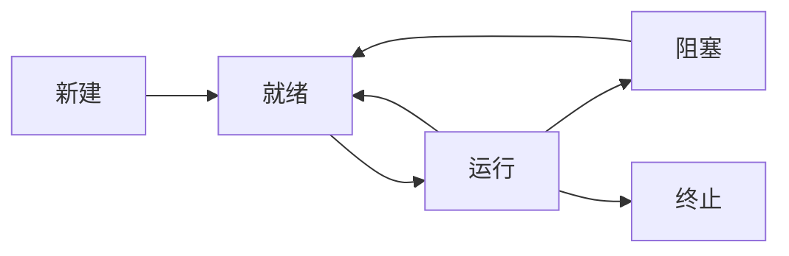

## 1.3 操作系统的运行环境

### 1.3.1 操作系统的运行机制

计算机系统中，通常CPU执行两种不同性质的程序：一种是操作系统内核程序，另一种是用户自编程序（即系统外层的应用程序，或简称“应用程序”）。

所谓特权指令，是指计算机中不允许用户直接使用的指令，如I/O指令、置中断指令、存取用于内存保护的寄存器、送程序状态字到程序状态字寄存器等的指令。

在具体的实现上，将CPU的状态划分为用户态（目态）和核心态（又称管态、内核态）。当CPU处于核心态，此时CPU可以执行特权指令；当CPU处于用户态，此时CPU只能执行非特权指令。用户自编程序运行在用户态，操作系统内核程序运行在核心态。

内核是计算机上配置的底层软件，是计算机功能的延伸。大多数操作系统内核包括4方面的内容。

1. 时钟管理

   操作系统需要通过时钟管理，向用户提供标准的系统时间。

   通过时钟中断的管理，可实现进程的切换。

2. 中断机制

   引入中断技术的初衷是提高多道程序运行环境中CPU的利用率，而且主要是针对外部设备的，后发展形成多种类型、成为操作系统各项操作的基础。可以说，现代操作系统是靠中断驱动的软件。

   中断机制中，只有一小部分功能属于内核，它们负责保护和恢复中断现场的信息，转移控制权到相关的处理程序。这样可以减少中断的处理时间，提高系统的并行处理能力。

3. 原语

   1. 处于操作系统的最底层，是最接近硬件的部分。
   2. 这些程序的运行具有原子性，其操作只能一气呵成。
   3. 这些程序的运行时间都较短，而且调用频繁。

   定义原语的直接方法是关闭中断，让其所有动作不可分割地完成后再打开中断。系统中的设备驱动、CPU切换、进程通信等功能中的部分操作都可定义为原语，使它们成为内核的组成部分。

4. 系统控制的数据结构及处理

   1. 进程管理：进程状态管理、进程调度和分派、创建与撤销进程控制块等。
   2. 存储器管理：存储器的空间分配和回收、内存信息保护程序、代码对换程序等。
   3. 设备管理：缓冲区管理、设备分配和回收等。

### 1.3.2 中断和异常的概念

中断（Interruption）也称==外中断==，指来自CPU执行指令以外的事件的发生。通常是与当前指令执行无关的事件，即它们与当前处理机运行的程序无关。

异常（Exception）也称==内中断==、例外、陷入（trap），指源自CPU执行指令内部的事件。对异常的处理一般要依赖于当前程序的运行现场，而且异常不能被屏蔽，一旦出现应立即处理。

中断的处理过程：

1. 关中断（硬件完成）：保护程序的现场状态，CPU不应响应更高级中断源的中断请求。
2. 保存断点（硬件完成）：保证中断服务程序执行完毕后能正确地返回到原来的程序。
3. 中断服务程序寻址（硬件完成）：取出中断服务程序的入口地址送入程序计数器PC。
4. 保存现场和屏蔽字（中断程序完成）：保存现场，现场信息一般是指程序状态字寄存器PSWR和某些通用寄存器的内容。
5. 开中断（中断程序完成）：允许更高级中断请求得到响应。
6. 执行中断服务程序（中断程序完成）：中断请求的目的。
7. 关中断（中断程序完成）：保证在恢复现场和屏蔽字时不被中断。
8. 恢复现场和屏蔽字（中断程序完成）
9. 开中断（中断程序完成）
10. 中断返回（中断程序完成）

### 1.3.3 系统调用

所谓系统调用，是指用户在程序中调用操作系统所提供的一些子功能，系统调用可视为特殊的公共子程序。系统中的各种共享资源都由操作系统统一掌管，因此在用户程序中，凡是与资源有关的操作都必须通过系统调用方式向操作系统提出服务请求，并由操作系统代为完成。按功能大致可分为以下几类：

- 设备管理：完成设备的请求或释放，以及设备启动等功能
- 文件管理：完成文件的读、写、创建及删除等功能
- 进程控制：完成进程的创建、撤销、阻塞及唤醒等功能
- 内存管理：完成内存的分配、回收以及获取作业占用内存区大小及始址等功能

用户程序不能直接执行对系统影响非常大的操作，必须通过系统调用的方式请求操作系统代为执行，以便保证系统的稳定性和安全性，防止用户程序随意更改或访问重要的系统资源，影响其他进程的进行。

操作系统的运行环境可以理解为：用户通过操作系统运行上层程序，上层程序的运行依赖于操作系统的底层管理程序提供服务支持，当需要管理程序服务时，系统则通过硬件中断机制进入核心态，运行管理程序，也可能是程序运行出现异常情况，被动的需要管理程序的服务，这时通过异常处理进入核心态。管理程序运行结束时，用户程序需要继续运行，此时通过相应的保存的程序现场退出中断处理程序或异常处理程序，返回断点继续执行。

==由用户态进入核心态，不仅状态需要切换，而且所用的堆栈也可能需要由用户堆栈切换为系统堆栈，但这个系统堆栈也是属于该进程的。==

若程序的运行由用户态转到核心态，则会用到访管指令，访管指令是在用户态使用的，所以它不可能是特权指令。

### 1.4.1 大内核和微内核

大内核系统将操作系统的主要功能模块都作为一个紧密联系的整体运行在核心态，从而为应用提供高性能的系统服务。因为各管理模块之间共享信息，能有效利用相互之间的有效特性，所以具有无可比拟的性能优势。

微内核将内核中最基本的功能（如进程管理等）保留在内核，而将那些不需要在核心态执行的功能移到用户态执行，从而降低了内核的设计复杂性。微内核结构有效地分离了内核与服务、服务与服务，使得它们之间的接口更加清晰，维护的代价大大降低，各部分可以独立地优化和演进，从而保证了操作系统的可靠性。最大问题是性能问题，因为需要频繁地在核心态和用户态之间进行切换，操作系统的执行开销偏大。

为减少切换开销，也有人提出将系统服务作为运行库链接到用户程序的一种解决方案，这样的体系结构称为库操作系统。

# 第 2 章 进程管理

## 2.1 进程与线程

### 2.1.1 进程的概念和特征

> 进程是进程实体的运行过程，是系统进行资源分配和调度的一个独立单位。

进程的特征

1. 动态性：进程是程序的一次执行，有创建、活动、暂停、终止等过程，是动态的产生、变化和消亡的。
2. 并发性：多个进程实体同时存于内存中，能在一段时间内同时运行。
3. 独立性：进程实体是一个能独立运行、独立获得资源和独立接受调度的基本单位。
4. 异步性：进程按各自独立的、不可预知的速度向前推进。（故有进程同步进制）
5. 结构性：进程实体是由程序段、数据段和进程控制块三部分组成。

### 2.1.2 进程的状态与转换

1. 运行态
2. 就绪态
3. 阻塞态
4. 创建态
5. 结束态

### 2.1.3 进程控制

1. 进程的创建

   1. 为新进程分配一个唯一的进程标识号，并申请一个空白的PCB。若PCB申请失败则创建失败。
   2. 为进程分配资源，为新进程的程序和数据及用户栈分配必要的内存空间。若资源不足则处于阻塞态。
   3. 初始化PCB。主要包括初始化标志信息、初始化处理机状态信息和初始化处理机控制信息，以及设置进程的优先级等。
   4. 若进程就绪队列能够接纳新进程，则将新进程插入就绪队列，等待被调度运行。

2. 进程的终止

   1. 根据被终止进程的标识符，检索PCB，从中读出该进程的状态。
   2. 若被终止进程处于执行状态，立即终止该进程的执行，将处理机资源分配给其他进程。
   3. 若该进程还有子孙进程，则应将其所有子孙进程终止。
   4. 将该进程所拥有的全部资源，或归还其父进程，或归还给操作系统。
   5. 将该PCB从所在队列（链表）中删除。

3. 进程的阻塞和唤醒

   阻塞：

   1. 找到将要被阻塞进程的标识号对应的PCB。
   2. 若该进程为运行态，则保护其现场，将其状态转为阻塞态，停止运行。
   3. 把该PCB插入相应事件的等待队列，将处理机资源调度给其他就绪进程。

   唤醒：

   1. 在该事件的等待队列中找到相应进程的PCB。
   2. 将其从等待队列中移出，并置其状态为就绪态。
   3. 把该PCB插入就绪队列，等待调度程序调度。

   Block原语是由被阻塞进程自我调用实现的，而Wakeup原语则是由一个与被唤醒进程合作或被其他相关的进程调用实现的。

4. 进程切换

   1. 保存处理机上下文，包括程序计数器和其他寄存器。
   2. 更新PCB信息。
   3. 把进程的PCB移入相应的队列，如就绪、在某事件阻塞等队列。
   4. 选择另一个进程执行，并更新其PCB。
   5. 更新内存管理的数据结构。
   6. 恢复处理机上下文。

### 2.1.4 进程的组织

1. 进程控制块

| 进程描述信息  | 进程控制和管理信息 | 资源分配清单 | 处理机相关信息 |
| :-----------: | :----------------: | :----------: | :------------: |
| 进程标识符PID |    进程当前状态    |  代码段指针  |  通用寄存器值  |
| 用户标识符UID |     进程优先级     |  数据段指针  |  地址寄存器值  |
|               |  代码运行入口地址  |  堆栈段指针  |  控制寄存器值  |
|               |   程序的外存地址   |  文件描述符  |  标志寄存器值  |
|               |    进入内存时间    |     键盘     |     状态字     |
|               |   处理机占用时间   |     鼠标     |                |
|               |     信号量使用     |              |                |

2. 程序段

   能被进程调度程序调度到CPU执行的程序代码段。==程序可被多个进程共享，即多个进程可以运行同一个程序。==

3. 数据段

   一个进程的数据段，可以是进程对应的程序加工处理的原始数据，也可以是程序执行时产生的中间或最终结果。

### 2.1.5 进程的通信

1. 共享存储

   在通信的进程之间存在一块可直接访问的共享空间，通过对这片共享空间进行读写操作实现进程之间的信息交换。

   低级方式的共享是基于数据结构的共享；

   高级方式的共享则是基于存储区的共享。

   操作系统只负责为通信进程提供可共享使用的存储空间和同步互斥工具，而数据交换则由哦用户自己安排读写指令完成。

2. 消息传递

   1. 直接通信方式：发送进程直接把消息发送给接收进程，并将它挂在接收进程的消息缓冲队列上，接收进程从消息缓冲队列中取得消息。
   2. 间接通信方式：发送进程把消息发送到某个中间实体，接收进程从中间实体取得消息。这种中间实体一般称为信箱，这种通信方式又称为信箱通信方式，相应的通信系统称为电子邮件系统。

3. 管道通信

   “管道”是指用于连接一个读进程和一个写进程以实现它们之间的通信的一个共享文件。

   管道机制必须提供三方面的协调能力：互斥、同步和确定对方的存在。

   1. 限制管道的大小。实际上，管道是一个固定大小的缓冲区。
   2. 读进程也可能工作得比写进程快。

   ==从管道读数据是一次性操作，数据一旦被读取，它就从管道中被抛弃，释放空间以便写更多数据。管道只能采用半双工通信。要实现父子进程双方互动通信，需要定义两个管道。==

### 2.1.6 线程概念和多线程模型

1. 线程的基本概念

   “轻量级进程”，它是一个基本的CPU执行单元，也是程序执行流的最小单位，由线程ID、程序计数器、寄存器集合和堆栈组成。线程是进程中的一个实体，是被系统独立调度和分派的基本单位。一个线程可以创建和撤销另一个线程，同一进程中的多个线程之间可以并发执行。

2. 线程与进程的比较

   1. 调度

      线程是独立调度的基本单位，进程是拥有资源的基本单位。

   2. 拥有资源

      进程是拥有资源的基本单位，而线程不拥有系统资源（也有一点必不可少的资源）。

   3. 并发性

      进程之间可以并发执行，多个线程之间也可以并发执行。

   4. 系统开销

      由于创建或撤销进程时，系统都要为之分配或回收资源，因此操作系统所付出的开销远大于创建或撤销线程时的开销。

      由于同一进程内的多个线程共享进程的地址空间，因此这些线程之间的同步与通信非常容易实现，甚至无需操作系统的干预。

   5. 地址空间和其他资源

      进程的地址空间之间互相独立，同一进程的各线程间共享进程的资源，某进程内的线程对于其他进程不可见。

   6. 通信方面

      进程间通信（IPC）需要进程同步和互斥手段的辅助，以保证数据的一致性，而线程间可以直接读写进程数据段来进行通信。

3. 线程的属性

   1. 线程是一个轻型实体，它不拥有系统资源，但每个线程都应有一个唯一的标识符和一个线程控制块，线程控制块记录了线程执行的寄存器和栈等现场状态。
   2. 不同的线程可以执行相同的程序，即同一个服务程序被不同的用户调用时，操作系统将它们创建成不同的线程。
   3. 同一进程中的各个线程共享该进程所拥有的资源。
   4. 线程是处理机的独立调度单位
   5. 一个线程被创建后，便开始了它的生命周期。

4. 线程的实现方式

   1. 用户级线程（User-Level Thread，ULT）

      在用户级线程中，有关线程管理的所有工作都由应用程序完成，内核意识不到线程的存在。应用程序可以通过使用线程库设计成多线程程序。

   2. 内核级线程（Kernel-Level Thread，KLT）又称内核支持的线程

      在内核级线程中，线程管理的所有工作由内核完成，应用程序没有进行线程管理的代码，只有一个到内核级线程的编程接口。内核为进程及其内部的每个线程维护上下文信息，调度也在内核基于线程架构的基础上完成。

   3. 组合方式

      线程创建完全在用户空间中完成，线程的调度和同步也在应用程序中进行。一个应用程序中的多个用户级线程被映射到一些（小于等于用户级线程数目）内核级线程上。

5. 多线程模型

   1. 多对一模型

      将多个用户级线程映射到一个内核级线程，线程管理在用户空间完成，用户级线程对操作系统不可见。

      优点：线程管理在用户空间进行的，因而效率比较高。

      缺点：一个线程在使用内核服务时被阻塞，整个进程都会被阻塞；多个线程不能并行地运行在多处理机上。

   2. 一对一模型

      将每个用户级线程映射到一个内核级线程。

      优点：一个线程被阻塞后，允许另一个线程执行，所以并发能力强。

      缺点：每创建一个用户级线程都需要创建一个内核级线程与其对应，这样创建线程的开销比较大，会影响到应用程序的性能。

   3. 多对多模型

      将n个用户级线程映射到m个内核级线程上，要求m<=n。

## 2.2 处理机调度

### 2.2.1 调度的概念

1. 调度的基本概念

   对处理机进行分配，即从就绪队列中按照一定的算法选择一个进程并将处理机分配给它运行，以实现进程并发地执行。

2. 调度的层次

   1. 作业调度（又称高级调度）
   2. 中级调度（又称内存调度）
   3. 进程调度（又称低级调度）

3. 三级调度的联系

### 2.2.2 调度的时机、切换与过程

不能进行进程的调度与切换的情况有以下几种：

1. 在处理中断的过程中。中断处理过程复杂，在实现上很难做到进程切换，而且中断处理是系统工作的一部分，逻辑上不属于某一进程，不应被剥夺处理机资源。
2. 进程在操作系统内核程序临界区中。进入临界区后，需要独占式地访问共享数据，理论上必须加锁，以防止其他并行程序进入，在解锁前不应切换到其他进程运行，以加快该共享数据的释放。
3. 其他需要完全屏蔽中断的原子操作过程中。在原子过程中，连中断都要屏蔽，更不应该进行进程调度与切换。

应该进行进程调度与切换的情况如下：

1. 发生引起调度条件且当前进程无法继续运行下去时，可以马上进行调度与切换。
2. 中断处理结束后或自陷处理结束后，返回被中断进程的用户态程序执行现场前，若置上请求调度标志，即可马上进行进程调度与切换。

### 2.2.3 进程调度方式

1. 非剥夺调度方式，又称非抢占方式
2. 剥夺调度方式，又称抢占方式

### 2.2.4 调度的基本准则

1. CPU利用率
2. 系统吞吐率
3. 周转时间
4. 等待时间
5. 响应时间

### 2.2.5 典型的调度算法

1. 先来先服务（FCFS)
2. 短作业优先（SJF)
3. 优先级调度算法
4. 高响应比优先调度算法
5. 时间片轮转调度算法
6. 多级反馈队列调度算法

