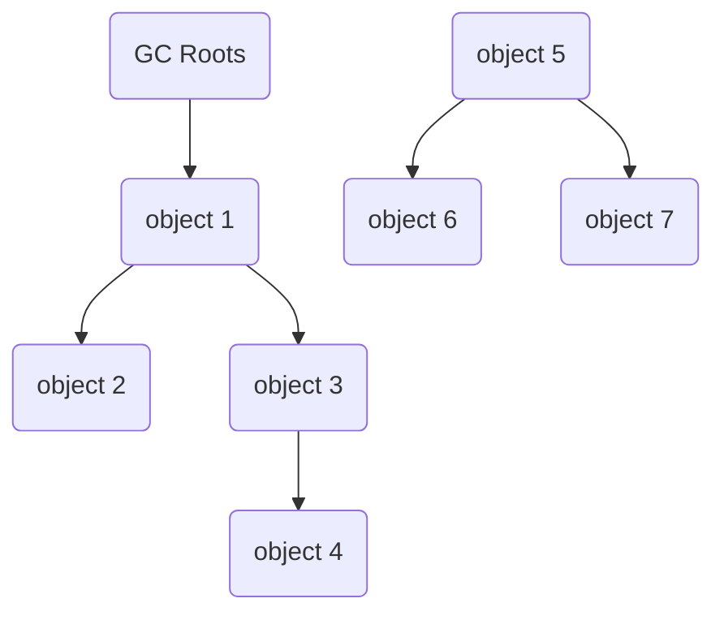
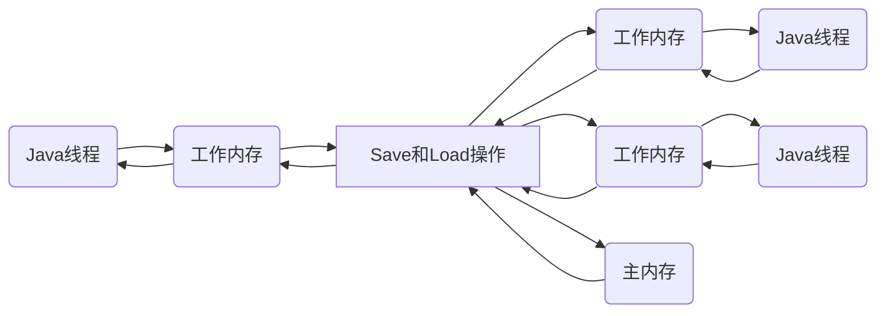

<div align=center><h1>第二部分 自动内存管理机制</h1></div>

# 第2章 Java内存区域与内存溢出异常

## 2.2 运行时数据区域

### 2.2.1 程序计数器

程序计数器（Program Counter Register）是一块较小的内存空间，它可以看作是当前线程所执行的字节码的行号指示器。在虚拟机的概念模型里（仅概念模型，可能通过更高效的方式实现），字节码解释器工作时就是通过改变这个计数器的值来选取下一条需要执行的字节码指令，分支、循环、跳转、异常处理、线程恢复等基础功能都需要依赖这个计数器来完成。

由于Java虚拟机的多线程是通过线程轮流切换并分配处理器执行时间的方式来实现的，在任何一个确定的时刻，一个处理器（对于多核处理器来说是一个内核）都只会执行一条线程中的指令。因此，为了线程切换后能恢复到正确的执行位置，每条线程都需要有一个独立的程序计数器，各条线程之间计数器互不影响，独立存储，称这类内存区域为“线程私有”的内存。

如果线程正在执行的是一个Java方法，这个计数器记录的是正在执行的虚拟机字节码指令的地址；如果正在执行的是Native方法，这个计数器值则为空（Undefined）。此内存区域是唯一一个在Java虚拟机规范中没有规定任何OutOfMemoryError情况的区域。

 ### 2.2.2 Java虚拟机栈

与程序计数器一样，Java虚拟机栈（Java Virtual Machine Stack）也是线程私有的，它的生命周期与线程相同。虚拟机栈描述的是Java方法执行的内存模型：每个方法在执行的同时都会创建一个栈帧<sup>方法运行的基础数据结构</sup>（Stack Frame）用于存储局部变量表、操作数栈、动态链接、方法出口等信息。每一个方法从调用直至执行完成的过程，就对应着一个栈帧在虚拟机中入栈到出栈的过程。


局部变量表存放了编译期可知的各种基本数据类型（boolean、byte、char、short、int、float、long、double）、对象引用（reference类型，它不等同于对象本身，可能是一个指向对象起始地址的引用指针，也可能是指向一个代表对象的句柄或其他与此对象相关的位置）和returnAdress类型（指向了一条字节码指令的地址）。

其中64位长度的long和double类型的数据会占用2个局部变量空间（Slot），其余的数据类型只占用1个。局部变量表所需的内存空间在编译期间完成分配，当进入一个方法时，这个方法需要在帧中分配多大的局部变量空间是完全确定的，在方法运行期间不会改变局部变量表的大小。

在Java虚拟机规范中，对这个区域规定了两种异常状况：

- 如果线程请求的栈深度大于虚拟机所允许的深度，将抛出StackOverflowError异常；
- 如果虚拟机可以动态扩展（大部分Java虚拟机都可动态扩展），如果扩展时无法申请到足够的内存，就会抛出OutOfMemoryError异常。

### 2.2.3 本地方法栈

本地方法栈（Native Method Stack）与虚拟机栈所发挥的作用是非常相似的，它们之间的区别不过是虚拟机栈为虚拟机执行Java方法（也就是字节码）服务，而本地方法栈则为虚拟机使用到的Native方法服务。在虚拟机规范中对本地方法栈中方法使用的语言、使用方式与数据结构并没有强制规定。与虚拟机栈一样，本地方法栈区域也会抛出StackOverflowError和OutOfMemoryError异常。

### 2.2.4 Java堆

对于大多数应用来说，Java堆（Java Heap）是Java虚拟机所管理的内存中最大的一块。Java堆是被所有线程共享的一块内存区域，在虚拟机启动时创建。此内存区域的唯一目的就是存放对象实例，**几乎所有**的对象实例都在这里分配内存。但随着JIT编译器的发展与逃逸分析技术逐渐成熟，栈上分配、标量替换优化技术导致一些微妙的变化发生，所有的对象都分配在堆上也渐渐变得不是那么“绝对”了。

Java堆是垃圾收集器管理的主要区域，因此很多时候也被称作“GC堆”（Garbage Collected Heap）。

从内存回收的角度看，由于现在收集器基本都采用分代收集算法，所以Java堆中还可以细分为：新生代和老年代；再细致一点的有Eden空间、From Survivor空间、To Survivor空间等。

从内存分配的角度看，线程共享的Java堆中可能划分出多个线程私有的分配缓冲区（Thread Local Allocation Buffer,TLAB)。

不过无论如何划分，都与存放内容无关，无论哪个区域，存储的都仍然是对象实例，进一步划分的目的是为了更好地回收内存，或者更快地分配内存。

根据Java虚拟机规范的规定，Java堆可以处于物理上不连续的内存空间中，只要逻辑上是连续的即可。在实现时，既可以实现成固定大小的，也可以是扩展的，不过当前主流的虚拟机都是按照可扩展来实现的（通过-Xmx和-Xms控制）。如果在堆中没有内存完成实例分配，并且堆也无法再扩展时，将会抛出OutOfMemoryError异常。

### 2.2.5 方法区

方法区（Method Area）与Java堆一样，是各个线程共享的内存区域，它用于存储已被虚拟机加载的类信息、常量、静态变量、即时编译器编译后的代码等数据。虽然Java虚拟机规范把方法区描述为堆的一个逻辑部分，但它却有一个别名叫做Non-Heap（非堆），目的应该是与Java堆区分开来。

在HotSpot虚拟机上，很多人更愿意把方法区称为“永久代”（Permanent Generation），本质上两者并不等价，仅仅是因为HotSpot虚拟机的设计团队选择把GC分代收集扩展至方法区，或者说使用永久代来实现方法区而已，这样HotSpot的垃圾收集器可以像管理Java堆一样管理这部分内存，能够省去专门为方法区编写内存管理代码的工作，对于其他虚拟机来说是不存在永久代的概念的。原则上，如何实现方法区属于虚拟机实现细节，不受虚拟机规范约束，但使用永久代来实现方法区，现在看来并不是一个好主意，因为这样更容易遇到内存溢出问题（永久代有-XX:MaxPermSize的上限），而且有极少数方法（例如String.intern()）会因为这个原因导致不同虚拟机下有不同的表现。

Java虚拟机规范对方法区的限制非常宽松，除了和Java堆一样不需要连续的内存和可选择固定大小或者可扩展外，还可以选择不实现垃圾收集。这区域的内存回收目标主要是针对常量池的回收和对类型的卸载，一般来说，这个区域的回收“成绩”比较难以令人满意，尤其是类型的卸载，条件相当苛刻，但是这部分区域的回收确实是必要的。

根据Java虚拟机规范的规定，当方法区无法满足内存分配需求时，将抛出OutOfMemoryError异常。

### 2.2.6 运行时常量池

运行时常量池（Runtime Constant Pool）是方法区的一部分。Class文件中除了有类的版本、字段、方法、接口等描述信息外，还有一项是常量池（Constant Pool Table），用于存放编译期生成的各种字面量和符号引用，这部分内容将在类加载后进入方法区的运行时常量池中存放。

Java虚拟机对Class文件每一部分（自然也包括常量池）的格式都有严格规定，每一个字节用于存储哪种数据都必须符合规范上的要求才会被虚拟机认可、装载和执行，但对于运行时常量池，Java虚拟机规范没有做任何细节的要求，不同的提供商实现的虚拟机可以按照自己的需要来实现这个内存区域。不过 ，一般来说，除了保存Class文件中描述的符号引用外，还会把翻译出来的直接引用也存储在运行时常量池中。

运行时常量池相对于Class文件常量池的另外一个重要特征是具备动态性，Java语言并不要求常量一定只有编译期才能产生，也就是并非预置入Class文件中常量池的内容才能进入方法区运行时常量池，运行期间也可能将新的常量放入池中，这种特性被开发人员利用的比较多的便是String类的intern()方法。

既然运行时常量池是方法区的一部分，自然受方法区内存的限制，当常量池无法再申请到内存时会抛出OutOfMemoryError异常。

### 2.2.7 直接内存

直接内存（Direct Memory）并不是虚拟机运行时数据区的一部分，也不是Java虚拟机规范中定义的内存区域。但是这部分内存也被频繁地使用，而且也可能导致OutOfMemoryError异常出血。

本机直接内存的分配不会受到Java堆大小的限制，但是，既然是内存，肯定还是会受到本机总内存（包括RAM以及SWAP区或者分页文件）大小以及处理器寻址空间的限制。服务器管理员再配置虚拟机参数时，会根据实际内存设置-Xmx等参数信息，但经常忽略直接内存，使得各个内存区域总和大于物理内存限制（包括物理的和操作系统级的限制），从而导致动态扩展时出现OutOfMemoryError异常。

## 2.3 HotSpot虚拟机对象探秘

### 2.3.1 对象的创建

虚拟机遇到一条new指令时，首先将去检查这个指令的参数是否能在常量池中定位到一个类的符号引用，并且检查这个符号引用代表的类是否已被加载、解析和初始化过。如果没有，就必须先执行相应的类加载过程。

在类加载检查通过后，虚拟机将为新生对象分配内存。对象所需内存的大小在类加载完成后便可完全确定，为对象分配空间的任务等同于把一块确定大小的内存从Java堆中划分出来。

假设Java堆中内存是绝对规整的，所有用过的内存都放在一边，空闲的内存放在另一边，中间放着一个指针作为分界点的指示器，所分配内存就仅仅是把那个指针先空闲空间那边挪动一段与对象大小相等的距离，这种分配方式称为“指针碰撞”（Bump the Pointer）。

如果Java堆中的内存并不是规整的，已使用的内存和空闲的内存相互交错，虚拟机就必须维护一个列表，记录哪些内存块是可用的，在分配的时候从列表中找到一块足够大的空间划分给对象实例，并更新列表上的记录，这种分配方式称为“空闲列表”（Free List）。

选择哪种分配方式由Java堆是否规整决定，而Java堆是否规整又由所采用的垃圾收集器是否带有压缩整理功能决定。因此，在使用Serial、ParNew等待Compact过程的收集器时，系统采用的分配算法是指针碰撞，而使用CMS这种基于Mark-Sweep算法的收集器时，通常采用空闲列表。

除如何划分可用空间之外，还有另外一个需要考虑的问题是对象创建在虚拟机中是非常频繁的行为，即使是仅仅修改一个指针所指向的位置，在并发情况下也并不是线程安全的，可能出现正在给对象A分配内存，指针还没来得及修改，对象B同时使用了原来的指针来分配内存的情况。解决这个问题有两种方案：

- 对分配内存空间的动作进行同步处理--实际上虚拟机采用CAS配上失败重试的方式保证更新操作的原子性。
- 把内存分配的动作按照线程划分在不同的空间之中进行，即每个线程在Java堆中预先分配一小块内存，称为本地线程分配缓冲（Thread Local Allocation Buffer，TLAB）。哪个线程要分配内存，就在哪个线程的TLAB上分配，只有TLAB用完并分配新的TLAB时，才需要同步锁定。虚拟机是否使用TLAB，可以通过-XX:+/-UseTLAB参数来设定。

内存分配完成后，虚拟机需要将分配到的内存空间都初始化为零值（不包括对象头），如果使用TLAB，这一工作过程也可以提前至TLAB分配时进行，这一步操作保证了对象的实例字段在Java代码中可以不赋初始值就直接使用，程序能访问到这些字段的数据类型对应的零值。

接下来，虚拟机要对对象进行必要的设置。将对象的信息存放在对象的对象头（Object Header）之中。根据虚拟机当前的运行状态的不同，如是否启用偏向锁等，对象头会有不同的设置方式。

在上面工作都完成之后，从虚拟机的视角来看，一个新的对象已经产生了，但从Java程序的视角来看，对象的创建才刚刚开始--<init>方法还没有执行，所有的字段都还为零。所有，一般来说（由字节码中是否跟随invokespecial指令所决定），执行new指令之后会接着执行<init>方法，把对象按照程序员的意愿进行初始化，这样一个真正可用的对象才算完全产生出来。

### 2.3.2 对象的内存布局

在HotSpot虚拟机中，对象在内存中存储的布局可以分为3块区域：对象头（Header）、实例数据（Instance Data）和对齐填充（Padding）。

HotSpot虚拟机的对象头包括两部分信息，第一部分用于存储对象自身的运行时数据，另一部分是类型指针，即对象指向它的类元数据的指针，虚拟机通过这个指针来确定这个对象哪来类的实例。

HotSpot虚拟机对象头Mark Word

|               存储内容               | 标志位 |        状态        |
| :----------------------------------: | :----: | :----------------: |
|       对象哈希码、对象分代年龄       |   01   |       未锁定       |
|           指向锁记录的指针           |   00   |     轻量级锁定     |
|          指向重量级锁的指针          |   10   | 膨胀（重量级锁定） |
|          空，不需要记录信息          |   11   |       GC标记       |
| 偏向线程ID、偏向时间戳、对象分代年龄 |   01   |       可偏向       |

实例数据部分是对象真正存储的有效信息，也是在程序代码中所定义的各种类型的字段内容。无论是从父类继承下来的，还是在子类中定义的，都需要记录起来。这部分的存储顺序会受到虚拟机分配策略参数（FieldsAllocationStyle）和字段在Java源码中定义顺序的影响。HotSpot虚拟机默认的分配策略为longs/doubles、ints、shorts/chars、bytes/booleans、oops(Ordinary Object Pointers)，从分配策略中可以看出，**相同宽度的字段总是被分配到一起**。在满足这个前提条件的情况下，**在父类中定义的变量会出现在子类之前**。如果CompactFields参数值为true（默认为true），那么子类中较窄的变量也可能会插入到父类变量的空隙中。

对齐填充并不是必然存在的，也没有特别的含义，仅起着占位符的作用。由于HotSpot VM的自动内存管理系统要求对象起始地址必须是8字节的整数倍，即对象的大小必须是8字节的整数倍。而对象头部分正好是8字节的倍数，故当对象实例数据部分没有对齐时，就需要通过对齐填充来补全。

### 2.3.3 对象的访问定位

建立对象是为了使用对象，Java程序需要通过栈上的reference数据来操作堆上的具体对象。由于reference类型在Java虚拟机规范中只规定了一个指向对象的引用，并没有定义这个引用应该通过何种方式去定位、访问堆中的对象的具体位置，所以对象访问方式也是取决于虚拟机实现而定的。目前主流的访问方式有使用句柄和直接指针两种。

- 使用句柄访问的话，Java堆中将会划分出一块内存来作为句柄池，reference中存储的就是对象的句柄地址，而句柄中包含了对象实例数据与类型数据各自的具体地址信息。
- 使用直接指针访问的话，Java堆对象的布局就必须考虑如何放置访问数据的相关信息，而reference中存储的直接就是对象地址。

这两种对象访问方式各有优势，使用句柄来访问的最大好处就是reference中存储的是稳定的句柄地址，在对象被移动（垃圾收集时移动对象是非常普遍的行为）时只会改变句柄的实例数据指针，而reference本身不需要修改。使用直接指针访问方式的最大好处就是速度更快，它节省了一次指针定位的时间开销，由于对象的访问在Java中非常频繁，因此此类开销积少成多后也是一项非常可观的执行成本。Sun HotSpot是使用第二种方式进行对象访问的，但从整个软件开发范围来看，各种语言和框架使用句柄来访问的情况也十分常见。

## 2.4 实战：OutOfMemoryError异常

### 2.4.1 Java堆溢出

```java
import java.util.ArrayList;
import java.util.List;

/**
 * VM Args:-Xms20m -Xmx20m -XX:+HeapDumpOnOutOfMemoryError
 */
public class HeapOOM {
    static class OOMObject{

    }
    public static void main(String[] args){
        int i=0;
        List<OOMObject> list = new ArrayList<OOMObject>();
        while(true){
            System.out.println(i++);
            list.add(new OOMObject());
        }
    }
}
```

> java.lang.OutOfMemoryError: Java heap space
> Dumping heap to java_pid2640.hprof ...
> Heap dump file created [2480042 bytes in 0.009 secs]
> Exception in thread "main" java.lang.OutOfMemoryError: Java heap space
> 	at java.util.Arrays.copyOf(Arrays.java:3210)
> 	at java.util.Arrays.copyOf(Arrays.java:3181)
> 	at java.util.ArrayList.grow(ArrayList.java:267)
> 	at java.util.ArrayList.ensureExplicitCapacity(ArrayList.java:241)
> 	at java.util.ArrayList.ensureCapacityInternal(ArrayList.java:233)
> 	at java.util.ArrayList.add(ArrayList.java:464)
> 	at HeapOOM.main(HeapOOM.java:16)

要解决这个区域的异常，一般是先通过内存映像分析工具对Dump出来的堆转储快照进行分析，重点是确认内存中的对象是否是必要的，也就是要先分清楚是出现了内存泄露（Memory Leak）还是内存溢出（Memory Overflow）。

如果是内存泄露，可进一步通过工具查看泄露对象到GC Roots的引用链。于是就能找到泄露对象是通过怎样的路径与GC Roots相关联并导致垃圾收集器无法自动回收它们的。掌握了泄露对象的类型信息及GC Roots引用链的信息，就可以比较准确地定位出泄露代码的位置。

如果不存在泄露，即内存中的对象确实都还必须存活着，那就应当检查虚拟机的堆参数（-Xmx与-Xms)，与机器物理内存对比看是否还可以调大，从代码上检查是否存在某些对象生命周期过长、持有状态时间过长的情况，尝试减少程序运行期的内存消耗。

### 2.4.2 虚拟机栈和本地方法栈溢出

- 如果线程请求的栈深度大于虚拟机所允许的最大深度，将抛出StackOverflowError异常。
- 如果虚拟机在扩展栈时无法申请到足够的内存空间，将抛出OutOfMemoryError异常。

```java
/**
 * VM args: -Xss128k
 */
public class JVMStackSOF {
    private int stack_length = 0;
    public void stackLeak(){
        stack_length++;
        stackLeak();
    }
    public static void main(String[] args)throws Throwable{
        JVMStackSOF oom = new JVMStackSOF();
        try{
            oom.stackLeak();
        }catch (Throwable e){
            System.out.println("stack length: "+oom.stack_length);
            throw e;
        }
    }
}
```

> stack length: 982
> Exception in thread "main" java.lang.StackOverflowError
> 	at JVMStackSOF.stackLeak(JVMStackSOF.java:7)
> 	at JVMStackSOF.stackLeak(JVMStackSOF.java:8)

在单个线程下，无论是由于栈帧太大还是虚拟机栈容量太小，当内存无法分配的时候，虚拟机抛出的都是StackOverflowError异常。

如果测试时不限于单线程，通过不断地建立线程的方式产生内存溢出异常，但是这样产生的内存溢出异常与栈空间是否足够大并不存在任何联系，或者说，在这种情况下，为每个线程的栈分配的内存越大，反而越容易产生内存溢出异常。

操作系统分配给每个进程的内存是有限制的，譬如32位Windows限制为2GB。虚拟机提供了参数来控制Java堆和方法区的这两部分内存的最大值。剩余的内存为2GB减去Xmx(最大堆容量)，再减去MaxPermSize(最大方法区容量)，程序计数器消耗内存很小，忽略不计。如果虚拟机进程本身耗费的内存不计算在内，剩下的内存就由虚拟机栈和本地方法栈“瓜分”。每个线程分配到的栈容量越大，可以建立的线程数量自然就越少，建立线程时就越容易把剩下的内存耗尽。

如果是建立过多线程导致的内存溢出，在不能减少线程数或者更换64位虚拟机的情况下，就只能通过减少最大堆和减少栈容量来换取更多的线程。

```java
/**
 * VM args:-Xss5M
 */
public class JVMStackOOM {
    private void dontStop(){
        while (true){

        }
    }
    public void stackLeakByThread(){
        while(true){
            Thread thread = new Thread(new Runnable() {
                @Override
                public void run() {
                    dontStop();
                }
            });
            thread.start();
        }
    }
    public static void main(String[] args){
        JVMStackOOM oom = new JVMStackOOM();
        oom.stackLeakByThread();
    }
}
```

Java的线程是映射到操作系统的内核线程上的，所以执行上述代码可能导致操作系统假死！

### 2.4.3 方法区和运行时异常量池溢出

String.intern()是一个Native方法，它的作用是，如果字符串常量池中已经包含一个

等于此String对象的字符串，则返回代表池中这个字符串的String对象；否则，将此对象包含的字符串添加到常量池中，并且返回此String对象的引用。在JDK1.6及之前的版本，由于常量池分配在永久代内，可以通过-XX:PermSize和-XX:MaxPermSize限制方法区大小，从而间接限制其中常量池的容量。

```java
/**
 * VM Args: -XX:PermSize=10M -XX:MaxPermSize=10M (jdk1.6)
 */
public class RuntimeConstantPoolOOM {
    public static void main(String[] args){
        List<String> list = new ArrayList<String>();
        int i = 0;
        while(true){
            System.out.println("i = "+i);
            list.add(String.valueOf(i++).intern());
        }
    }
}
```

> Exception in thread "main" java.lang.OutOfMemoryError: PermGen space
> 	at java.lang.String.intern(Native Method)
> 	at RuntimeConstantPoolOOM.main(RuntimeConstantPoolOOM.java from InputFileObject:13)

运行时常量类溢出，在OutOfMemoryError后面跟随的提示信息是"PermGen space"，说明运行时常量池属于方法区（HotSpot虚拟机中的永久代）的一部分。而使用JDK1.7运行这段程序就不会得到相同的结果，while循环将一直进行下去。

```java
public class RuntimeConstantPoolOOM {
    public static void main(String[] args){
        String str1 = new StringBuilder("计算机").append("软件").toString();
        System.out.println(str1.intern()==str1); // 8:true    6:false
        String str2 = new StringBuilder("ja").append("va").toString();
        System.out.println(str2.intern()==str2); // 8:false   6:false
    }
}
```

在JDK1.6中，intern()方法会把首次遇到的字符串实例复制到永久代中，返回的也是永久代中这个字符串实例的引用，而由StringBuilder创建的字符串实例在Java堆上，所以必然不是同一个引用，将返回false。而JDK1.8的intern()实现不会再复制实例，只是在常量池记录首次出现的实例引用，因此intern()返回的引用和由StringBuilder创建的那个字符串实例是同一个。对str2比较返回false是因为"java"这个字符串在执行StringBuilder.toString()之前已经出现过，字符串常量池中已经有它的引用了，不符合首次出现的原则，而“计算机软件”这个字符串则是首次出现的，因此返回true。

方法区用于存放Class的相关信息，如类名、访问修饰符、常量池、字段描述、方法描述等。对于这些区域的赤峰市，基本的思路是运行时产生大量的类去填满方法区，直到溢出。

### 2.4.4 本机直接内存溢出

DirectMemory容量可通过-XX:MaxDirectMemorySize指定，如果不指定则默认与Java堆最大值（-Xmx指定）一样。

```java
import java.lang.reflect.Field;

/**
 * VM args: -XX:MaxDirectMemorySize=10M
 */
public class DirectMemoryOOM {
    private static final int _1MB = 1024*1024;
    public static void main(String[] args) throws Exception{
        int i = 0;
        Field unsafeField = Unsafe.class.getDeclaredFields()[0];
        unsafeField.setAccessible(true);
        Unsafe unsafe = (Unsafe) unsafeField.get(null);
        while(true){
            System.out.println(i++);
            unsafe.allocateMemory(_1MB);
        }
    }
}
```

> Exception in thread "main" java.lang.OutOfMemoryError
> 	at sun.misc.Unsafe.allocateMemory(Native Method)
> 	at DirectMemoryOOM.main(DirectMemoryOOM.java:17)

由DirectMemory导致的内存溢出，一个明显的特征是在Heap Dump文件中不会看见明显的异常，如果OOM之后Dump文件很小，而程序直接或间接使用了NIO，就可以考虑检查是不是这方面的原因。

# 第3章 垃圾收集器与内存分配策略

Java与C++之间有一堵由内存动态分配和垃圾收集技术所围成的“高墙”，墙外面的人想进去，墙里面的人却想出来。

第2章介绍了Java内存运行时区域的各个部分，其中程序计数器、虚拟机栈、本地方法栈3个区域随线程而生，随线程而灭；栈中的栈帧随着方法的进入和退出而有条不紊地执行着出栈和入栈操作。每一个栈帧中分配多少内存基本上是在类结构确定下来时就已知的，在这几个区域内不需要过多考虑回收的问题，因为方法结束或者线程结束时，内存就跟随着回收了。而Java堆和方法区则不一样，一个接口中的多个实现类需要的内存可能不一样，一个方法中的多个分支需要的内存也可能不一样，我们只有在程序处于运行期间时才能知道会创建哪些对象，这部分内存的分配和回收都是动态的，垃圾收集器所关注的是这部分内存。

## 3.2 对象已死吗

垃圾收集器在对堆进行回收前，第一件事情就是要确定这些对象之中哪些还“存活”着，哪些已经“死去”（即不可能再被任何途径使用的对象）。

### 3.2.1 引用计数算法

引用计数算法（Reference Counting）的实现简单，判定效率也很高，大部分情况下都是一个不错的算法，但是，至少主流的Java虚拟机里面没有选用引用计数算法来管理内存，其中最主要的原因是它很难解决对象之间相互循环引用的问题。

### 3.2.2 可达性分析算法

在主流的商用程序语言（Java、C#，甚至包括古老的Lisp）的主流实现中，都是称通过可达性分析（Reachability Analysis）来判定对象是否存活。

这个算法基本思路就是通过一系列的称为“GC Roots”的对象作为起始点，从这些节点开始向下搜索，搜索走过的路径称为引用链（Reference Chain），当一个对象到GC Roots没有任何引用链相连（用图论的话说，就是从GC Roots到这个对象不可达）时，则证明此对象是不可用的。



对象object 5、object 6、object 7虽然互相有关联，但是它们到GC Roots是不可达的，所以它们将会被判定为是可回收的对象。

在Java语言中，可作为GC Roots的对象包括下面几种：

- 虚拟机栈（栈帧中的本地变量表）中引用的对象
- 方法区中类静态属性引用的对象
- 方法区中常量引用的对象
- 本地方法栈中JNI（即Native方法）引用的对象

### 3.2.3 再谈引用

无论是通过引用技术算法判断对象的引用数量，还是通过可达性分析算法判断对象的引用链是否科大，判定对象是否存活都与“引用”有关。JDK1.2以前，J如果reference类型的数据中存储的数值代表的是另外一个内存的起始地址，就称这块内存代表着一个引用。JDK1.2以后，Java堆引用的概念进行了扩充，将引用分为强引用（Strong Reference）、软引用（Soft Reference）、弱引用（Weak Reference）、虚引用（Phantom Reference）4种，这4种引用强度一次逐渐减弱。

- 强引用，类似“Object obj = new Object()”这类的引用，只要强引用还存在，垃圾收集器永远不会回收掉被引用的对象。
- 软引用是用来描述一些还有用但并非必需的对象。对于软引用关联着的对象，在系统将要发生内存溢出异常之前，将会把这些对象列进回收范围之中进行第二次回收。如果这次回收还没用足够的内存，才会抛出内存溢出异常。(SoftReference)
- 弱引用也是用来描述非必需对象的，但是它的强度比软引用更弱一些，被弱引用关联的对象只能生存到下一次垃圾收集发生之前。当垃圾收集器工作时，无论当前内存是否足够都会回收掉只被弱引用关联的对象。(WeakReference)
- 虚引用也称为幽灵引用或者幻影引用，它是最弱的一种引用关系。一个对象是否有虚引用的存在，完全不会对其生存时间构成影响，也无法通过虚引用来取得一个对象实例。为一个对象设置虚引用关联的唯一目的就是能在这个对象被收集器回收时收到一个系统通知。(PhantomReference)

### 3.2.4 生存还是死亡

即使在可达性分析算法中不可达的对象，也并非是“非死不可”，这时它们暂时处于“缓刑”阶段，要真正宣告一个对象死亡，至少要经历两次标记过程：如果对象在进行可达性分析后发现没有与GC Roots相连接的引用链，那它将会被第一次标记并且进行一次筛选，筛选的条件是此对象是否有必要执行finalize()方法。当对象没有覆盖finalize()方法或者finalize()方法已经被虚拟机调用过，虚拟机将这两种情况都视为“没必要执行”。

如果这个对象被判定位有必要执行finalize()方法，那么这个对象将会放置在一个叫做F-Quene的队列之中，并在稍后由一个由虚拟机自动建立的、低优先级的Finalizer线程去执行它。这里的“执行”是指虚拟机会触发这个方法，但并不承诺会等待它运行结束，原因是，如果一个对象在finalize()方法中执行缓慢，或者发生了死循环，将很可能会导致F-Quene队列中其他对象永久处于等待，甚至导致整个内存回收系统崩溃。finalize()方法是对象逃脱死亡命运的最后一次机会，稍后GC将对F-Quene中的对象进行第二次小规模的标记，如果对象要在finalize()中成功拯救自己，只要重新与引用链上的任何一个对象建立关联即可。如果对象这时候还没有逃脱，那基本上它就真的被回收了。

```java
public class FinalizeEscapeGC {
    public static FinalizeEscapeGC SAVE_HOOK = null;
    public void isAlive(){
        System.out.println("Yes,I am still alive :)");
    }
    @Override
    protected void finalize() throws Throwable{
        super.finalize();
        System.out.println("finalize method excuted!");
        FinalizeEscapeGC.SAVE_HOOK = this;
    }
    public static void main(String[] args) throws Throwable{
        SAVE_HOOK = new FinalizeEscapeGC();
        //对象第一次自救成功
        SAVE_HOOK = null;
        System.gc();
        Thread.sleep(500);//finalize方法优先级低，暂停0.5秒等待它
        if(SAVE_HOOK != null){
            SAVE_HOOK.isAlive();
        }else {
            System.out.println("no, i am dead :(");
        }
        //对象第二次自救失败
        SAVE_HOOK = null;
        System.gc();
        Thread.sleep(500);//finalize方法优先级低，暂停0.5秒等待它
        if(SAVE_HOOK != null){
            SAVE_HOOK.isAlive();
        }else {
            System.out.println("no, i am dead :(");
        }
    }
}
```

> finalize method excuted!
> Yes,I am still alive :)
> no, i am dead :(

任何一个对象的finalize()方法都只会被系统自动调用一次，如果对象面临下一次回收，它的finalize()方法不会被再次执行。

finalize()不是C/C++中的析构函数，而是Java刚诞生时做出的一个妥协，它的运行代价高昂，不确定性大，无法保证各个对象的调用顺序，finalize()能做的所有工作，使用try-finally或者其他方式都可以做的更好、更及时。

### 3.2.5 回收方法区

永久代的垃圾收集主要回收两部分内容：废弃常量和无用的类。回收废弃常量与回收Java堆中的对象非常类似。若没有地方引用某常量，这时发生内存回收且必要，则该常量会被系统清理出常量池。常量池中的其他类（接口）、方法、字段的符号引用也与此类似。

“无用的类”的判定需要同时满足下面3个条件：

- 该类所有的实例都已经被回收，即Java堆中不存在该类的任何实例。
- 加载该类的ClassLoader已经被回收。
- 该类对应的java.lang.Class对象没有在任何地方被引用，无法在任何地方通过反射访问该类的方法。

虚拟机可以对满足上述3个条件的无用类进行回收，而不是和对象一样，不使用了就必然会回收。是否对类进行回收，HotSpot虚拟机提供了-Xnoclassgc参数进行控制，还可以使用-verbose:class以及-XX:+TraceClassLoading、-XX:+TraceClassUnLoading查看类加载和卸载信息，其中

-verbose:class和-XX:+TraceClassLoading可以在Product版的虚拟机中使用，-XX:+TraceClassUnLoading参数需要FastDebug版的虚拟机支持。

在大量使用反射、动态代理、CGLib等ByteCode框架、动态生成JSP以及OSGi这类频繁自定义ClassLoader的场景都需要虚拟机具备类卸载的功能，以保证永久代不会溢出。

## 3.3 垃圾收集算法

### 3.3.1 标记-清除算法

最基础的收集算法是“标记-清除”（Mark-Sweep）算法，首先标记出所有需要回收的对象，在标记完成后统一回收所有被标记的对象。它的主要不足有两个：一个是效率问题，标记和清除两个过程的效率都不高；另一个是空间问题，标记清除后会产生大量不连续的内存碎片，空间碎片太多可能会导致以后在程序运行过程中需要分配较大对象时，无法找到足够的连续内存而不得不提前触发另一次垃圾收集动作。

### 3.3.2 复制算法

为了解决效率问题，一种称为“复制”（Copying）的收集算法出现了，它将可用内存按容量划分大小相等的两块，每次只使用其中的一块。当这一块的内存用完了，就将还存活的对象复制到另外一块上面，然后再把已使用过的内存空间一次清理掉。这样使得每次都是对整个半区进行内存回收，内存分配时也就不用考虑内存碎片等复杂情况，只要移动堆顶指针，按顺序分配内存即可，实现简单，运行高效，只是将内存缩小为原来的一半，代价高。

HotSpot虚拟机默认Eden和Survivor的大小比例是8:1，也就是每次新生代中可用内存空间为整个新生代容量的90%，当Survivor空间不够用时，需要依赖其他内存（老年代）进行分配担保（Handle Promotion）。

### 3.3.3 标记-整理算法

根据老年代的特点，有另外一种“标记-整理”算法，标记过程与“标记-清除”算法一样，但后续步骤不是直接对可回收对象进行清理，而是让所有存活的对象都向一端移动，然后直接清理掉端边界以外的内存。

### 3.3.4 分代收集算法

当前商业虚拟机的垃圾收集都采用“分代收集”（Generation Collection）算法，根据对象存活周期的不同将内存划分为几块，一般是把Java堆分为新生代和老年代，根据各个年代的特点采用最适当的收集算法。在新生代中，每次垃圾收集时都发现有大批对象死去，只有少量存活，就选用复制算法。而老年代中因对象存活率高、没有额外空间对它进行分配担保，就必须使用“标记-清理”或者“标记-整理”算法来进行回收。

## 3.4 HotSpot的算法实现

### 3.4.1 枚举根节点

由于目前的主流Java虚拟机使用的都是准确式GC，所以当执行系统停顿下来后，并不需要一个不漏地检查完所有执行上下文和全局的引用位置，虚拟机应当是有办法直接得知哪些地方存放着对象引用。在HotSpot的实现中，是使用一组称为OopMap的数据结构来达到这个目的，在类加载完成的时候，HotSpot就把对象内什么偏移量上是什么类型的数据计算出来，在JIT编译过程中，也会在特定的位置记录下栈和寄存器中哪些位置是引用。这样，GC在扫描时就可以直接得知这些信息了。

### 3.4.2 安全点

在OopMap的协助下，HotSpot可以快速且准确地完成GC Roots枚举，但可能导致引用关系变化，或者说OopMap内容变化的指令非常多，如果为每一条指令都生成对应的OopMap，将会需要大量的额外空间，GC的空间成本将会变得很高。

实际上，HotSpot也的确没有为每条指令都生成OopMap，只是在“特定的位置”记录了这些信息，这些位置称为安全点（Safepoint），即程序执行时并非在所有地方都能停顿下来开始GC，只有在到达安全点时才能暂停。Safepoint的选定既不能太少以致于让GC等待时间太长，也不能过于频繁以致于过分增大运行时的负荷。所以，安全点的选定基本上是以程序“是否具有让程序长时间执行的特征”为标准进行选定的--因为每条指令执行的时间都非常短暂，程序不太可能因为指令流长度太长这个原因而过长时间运行，“长时间执行”的最明显特征就是指令序列复用，例如方法调用、循环跳转、异常跳转等，所以具有这些功能的指令才会产生Safepoint。

对于Safepoint，另一个需要考虑的问题是如何在GC发生时让所有线程（不包括执行JNI调用的线程）都“跑”到最近的安全点上再停顿下来。

有两种方案可供选择：

- 抢先式中断：不需要线程的执行代码主动去配合，在GC发生时，首先把所有线程全部中断，如果发现有线程中断的地方不在安全点上，就恢复线程，让他“跑”到安全点上。现在几乎没有虚拟机实现采用抢先式中断来暂停线程从而响应GC事件。
- 主动式中断：当GC需要中断线程时，不直接对线程操作，仅设置一个标志，各个线程执行时主动去轮询这个标志，发现中断标志为真时就自己中断挂起。轮询标志的地方和安全点是重合的，另外再加上创建对象需要分配内存的地方。

### 3.4.3 安全区域

Safepoint机制保证了程序执行时，在不太长的时间内就会遇到可进入GC的Safepoint。而程序不执行时，即没有分配CPU时间，需要安全区域（Safe Region)来解决。

安全区域是指在一段代码片段之中，引用关系不会发生变化。在这个区域中的任意地方开始GC都是安全的，可看做是被扩展了的Safepoint。

在线程执行到Safe Region中的代码时，首先标识自己已经进入了Safe Region，当在这段时间里JVM要发起GC时，就不用管标识自己为Safe Region状态的线程了。在线程要离开Safe Region时，它要检查系统是否已经完成了根节点枚举（或者是整个GC过程），如果完成了，线程就继续执行，否则就必须等待直到收到可以安全离开Safe Region的信号为止。

## 3.5 垃圾收集器

如果说收集算法是内存回收的方法论，那垃圾收集器就是内存回收的具体实现。Java虚拟机规范中对垃圾收集器应该如何实现并没有任何规定，因此不同的虚拟机所提供的垃圾收集器可能会有很大差别。

### 3.5.1 Serial收集器

Serial收集器是最基本、发展历史最悠久的收集器，曾经（JDK1.3.1之前）是虚拟机新生代收集的唯一选择。在它进行垃圾收集时，必须暂停其他所有的工作线程，直到它收集结束。实际上，它依然是虚拟机运行在Client模式下的默认新生代收集器，简单而高效，对于限定单个CPU的环境来说，Serial收集器由于没有线程交互的开销，专心做垃圾收集自然可以获得最高的单线程收集效率。

### 3.5.2 ParNew收集器

ParNew收集器其实就是Serial收集器的多线程版本，除了使用多条线程进行垃圾收集之外，其余行为包括Serial收集器可用的所有控制参数、收集算法、Stop The World、对象分配规则、回收策略等都与Serial收集器完全一样。它是许多运行在Server模式下的虚拟机中首选的新生代收集器，其中一个原因就是，除了Serial收集器外，目前只有它能与CMS收集器配合工作。

### 3.5.3 Parallel Scavenger收集器

Parallel Scavenger收集器是一个新生代收集器，也是使用复制算法的收集器，又是并行的多线程收集器，关注点与其他收集器不同（尽可能地缩短垃圾收集时用户线程的停顿时间），Parallel Scavenger收集器的目标是达到一个可控制的吞吐量（Throughput）。所谓吞吐量就是CPU用于运行用户代码的时间与CPU总消耗时间的比值，即吞吐量=运行用户代码时间/(运行用户代码时间+垃圾收集时间)。

停顿时间越短就越适合需要与用户交互的程序，良好的响应速度能提升用户体验，而高吞吐量则可以高效率地利用CPU时间，尽快完成程序的运算任务，主要适合在后台运算而不需要太多交互的任务。

Parallel Scavenger收集器提供了两个参数用于精确控制吞吐量。

- 控制最大垃圾收集停顿时间-XX:MaxGCPauseMills，允许的值是一个大于0的毫秒数，GC停顿时间缩短是以牺牲吞吐量和新生代空间来换取的，并不是值越小，系统的垃圾收集速度就更快。
- 直接设置吞吐量大小-XX:GCTimeRadio，允许的值是一个大于0且小于100的整数，也就是垃圾收集时间占总时间的比率，相当于吞吐量的倒数。

GC自适应的调节策略（GC Ergonomics）：-XX：+UseAdaptiveSizePolicy参数打开后，不需要手工指定新生代的大小（-Xmn）、Eden与Survivor区的比例（-XX:SurvivorRatio）、晋升老年代对象年龄（-XX:PretenureSizeThreshold)等细节参数，虚拟机会根据当前系统的运行情况收集性能监控信息，动态调整这些参数以提供最合适的停顿时间或者最大的吞吐量。自适应调节策略也是Parallel Scavenger收集器与ParNew收集器的一个重要区别。

### 3.5.4 Serial Old收集器

Serial Old是Serial收集器的老年代版本，同样是一个单线程收集器，使用“标记-整理”算法，也是给Client模式下的虚拟机使用。如果在Server模式下，主要还有两大用途：

- JDK1.5及之前的版本中与Parallel Scavenger收集器搭配使用
- 作为CMS收集器的后备预案，在并发收集发生Concurrent Mode Failure时使用

### 3.5.5 Parallel Old收集器

Parallel Old是Parallel Scavenger收集器的老年版本，使用多线程和“标记-整理”算法，在JDK1.6中才开始提供。

### 3.5.6 CMS收集器

CMS（Concurrent Mark Sweep）收集器是一种以获取最短回收停顿时间为目标的收集器。符合重视服务的响应速度，希望系统停顿时间最短，以给用户较好体验这类应用的需求。

CMS收集器是基于“标记-清除”算法实现的，整个过程分为4个过程：

- 初始标记（CMS initial mark）
- 并发标记（CMS concurrent mark）
- 重新标记（CMS remark）
- 并发清除（CMS concurrent sweep）

其中，初始标记、重新标记仍需要“Stop The World”。初始标记仅标记一下GC Roots能直接关联到的对象，速度很快，并发标记阶段就是进行GC Roots Tracing的过程，而重新标记阶段则是为了修正并发标记期间因用户程序继续运作而导致标记产生变动的那一部分对象的标记记录，这个阶段的停顿时间一般会比初始标记阶段稍长一些，但远比并发标记的时间短。

由于整个过程中耗时最长的并发标记和并发清除过程收集器线程都可以与用户线程一起工作，所以从总体上来说，CMS收集器的内存回收过程是与用户线程一起并发执行的。

CMS的主要优点：并发收集、低停顿

三个明显的缺点：

- 对CPU资源敏感
- 无法处理浮动垃圾（Floating Garbage），可能出现“Concurrent Mode Failure”失败而导致另一次Full GC的产生
- 收集结束时会有大量空间碎片产生

### 3.5.7 G1收集器

G1（Garbage-First）收集器是当今收集器技术发展的最前沿成果之一。

G1具备如下特点：

- 并行与并发
- 分代收集
- 空间整合
- 可预测的停顿

使用G1收集器时，Java堆的内存布局就与其他收集器有很大差别，它将整个Java堆划分为多个大小相等的独立区域（Region），虽然还保留有新生代和老年代的概念，但新生代和老年代不再是物理隔离的了，都是一部分Region（不需要连续）的集合。

G1收集器之所以能建立可预测的停顿时间模型，是因为它可以有计划地避免在整个Java堆中进行全区域的垃圾收集。G1跟踪各个Region里面的垃圾堆积的价值大小（回收所获得的空间大小以及回收所需时间的经验值），在后台维护一个优先列表，每次根据运行的收集时间，优先回收价值最大的Region。这种Region划分内存空间以及优先级的区域回收方式，保证了G1收集器在有限的时间内可以获取尽可能高的收集效率。

如果不计算维护Rememberd Set的操作，G1收集器的运作大致可划分为：

- 初始标记（Initial Marking）
- 并发标记（Concurrent Marking）
- 最终标记（Final Marking）
- 筛选回收（Live Data Counting and Evacuation）

### 3.5.8 理解GC日志

### 3.5.9 垃圾收集器参数总结

## 3.6 内存分配与回收策略

对象的内存分配，往大方向讲，就是在堆上分配(但也可能经过JIT编译后被拆散为标量类型并间接地栈上分配)，对象主要分配在新生代的Eden区上，如果启动了本地线程分配缓冲，将按线程优先在TLAB上分配。少数情况下也可能会直接分配在老年代中，分配的规则并不是固定的，其细节取决于当前使用的是哪一种垃圾收集器组合，还有虚拟机中与内存相关的参数的设置。

### 3.6.1 对象优先在Eden分配

大多数情况下，对象在新生代Eden区中分配。当Eden区没有足够空间进行分配时，虚拟机将发起一次Minor GC。

> 新生代GC（Minor GC）：指发生在新生代的垃圾收集动作，因为Java对象大多数都具备朝生夕灭的特性，所以Minor GC非常频繁，一般回收速度也比较快。
>
> 老年代GC（Major GC/Full GC）：指发生在老年代的GC，出现了Major GC，经常会伴随至少一次的Minor GC（但非绝对的，在Parallel Scavenger收集器的收集策略里就有直接进行Major GC的策略选择过程）。Major GC的速度一般会比Minor GC慢10倍以上。

```java
/**
 * VM args: -verbose:gc -Xms20m -Xmx20m -Xmn10m -XX:+PrintGCDetails -XX:SurvivorRatio=8
 */
public class testAllocation {
    private static final int _1MB = 1024 * 1024;
    public static void main(String[] args){
        byte[] allocation1,allocation2,allocation3,allocation4;
        allocation1 = new byte[ 2 * _1MB];
        allocation2 = new byte[ 2 * _1MB];
        allocation3 = new byte[ 2 * _1MB];
        allocation4 = new byte[ 4 * _1MB];
    }
}
```

> Heap
>  PSYoungGen      total 9216K, used 8152K [0x00000000ff600000, 0x0000000100000000, 0x0000000100000000)
>   eden space 8192K, 99% used [0x00000000ff600000,0x00000000ffdf6120,0x00000000ffe00000)
>   from space 1024K, 0% used [0x00000000fff00000,0x00000000fff00000,0x0000000100000000)
>   to   space 1024K, 0% used [0x00000000ffe00000,0x00000000ffe00000,0x00000000fff00000)
>  ParOldGen       total 10240K, used 4096K [0x00000000fec00000, 0x00000000ff600000, 0x00000000ff600000)
>   object space 10240K, 40% used [0x00000000fec00000,0x00000000ff000010,0x00000000ff600000)
>  Metaspace       used 3288K, capacity 4496K, committed 4864K, reserved 1056768K
>   class space    used 358K, capacity 388K, committed 512K, reserved 1048576K

"eden space 8192K, from space 1024K, to space 1024K"，新生代总可用空间为9216KB（Eden区+1个Survivor区的总容量）。

### 3.6.2 大对象直接进入老年代

所谓的大对象是指，需要大量连续内存空间的Java对象。经常出现大对象容易导致内存还有不少空间就提前触发垃圾收集以获取足够的连续空间来“安置”它们。

虚拟机提供了一个-XX:PretenureSizeThreshold参数，令大于这个设置值的对象直接在老年代分配。这样做的目的是避免在Eden区及两个Survivor区之间发生大量的内存复制（新生代采用复制算法收集内存）。

```java
/**
 * VM args: -verbose:gc -Xms20M -Xmx20M -Xmn10M -XX:+PrintGCDetails -XX:SurvivorRatio=8
 *          -XX:PretenureSizeThreshold=1048576
 */
public class testPretenureSizeThreshold {
    private static final int _1MB = 1024 * 1024;
    public static void main(String[] args){
        byte[] allocation;
        allocation = new byte[ 4 * _1MB];
    }
}
```

### 3.6.3 长期存活的对象将进入老年代

虚拟机给每个对象定义了一个对象年龄计数器。如果对象在Eden出生并经过第一次Minor GC后仍然存活，并且能被Survivor容纳，将被移动到Survivor空间中，并且对象年龄设为1.对象中Survivor区中每“熬过”一次Minor GC，年龄就增加1岁，当它的年龄增加到一定程度（默认为15岁），就将会被晋升到老年代中。对象晋升老年代的年龄阈值，可以通过参数-XX:MaxTenuringThreshold设置。

```java
/**
 * VM args: -verbose:gc -Xms20M -Xmx20M -Xmn10M -XX:+PrintGCDetails -XX:SurvivorRatio=8
 *          -XX:MaxTenuringThreshold=1 -XX:+PrintTenuringDistribution -XX:+UseSerialGC
 */
public class testTenuringThreshold {
    private static final int _1MB = 1024 * 1024;
    public static void main(String[] args){
        byte[] allocation1,allocation2,allocation3;
        allocation1 = new byte[_1MB/4];
        allocation2 = new byte[4 * _1MB];
        allocation3 = new byte[4 * _1MB];
        allocation3 = null;
        allocation3 = new byte[4 * _1MB];
    }
}
```

> -XX:MaxTenuringThreshold=1
>
> [GC[DefNew
> Desired survivor size 524288 bytes, new threshold 1 (max 1)
>
> - age   1:     793944 bytes,     793944 total
> : 5854K->775K(9216K), 0.0033400 secs] 5854K->4871K(19456K), 0.0033755 secs] [Times: user=0.00 sys=0.00, real=0.00 secs] 
> [GC[DefNew
> Desired survivor size 524288 bytes, new threshold 1 (max 1)
> - age   1:        224 bytes,        224 total
>   : 5039K->0K(9216K), 0.0012552 secs] 9135K->4868K(19456K), 0.0012760 secs] [Times: user=0.00 sys=0.00, real=0.00 secs] 
>   Heap
>    def new generation   total 9216K, used 4178K [0x00000000f9a00000, 0x00000000fa400000, 0x00000000fa400000)
>   eden space 8192K,  51% used [0x00000000f9a00000, 0x00000000f9e14820, 0x00000000fa200000)
>   from space 1024K,   0% used [0x00000000fa200000, 0x00000000fa2000e0, 0x00000000fa300000)
>   to   space 1024K,   0% used [0x00000000fa300000, 0x00000000fa300000, 0x00000000fa400000)
>    tenured generation   total 10240K, used 4868K [0x00000000fa400000, 0x00000000fae00000, 0x00000000fae00000)
>    the space 10240K,  47% used [0x00000000fa400000, 0x00000000fa8c1310, 0x00000000fa8c1400, 0x00000000fae00000)
>    compacting perm gen  total 21248K, used 2938K [0x00000000fae00000, 0x00000000fc2c0000, 0x0000000100000000)
>    the space 21248K,  13% used [0x00000000fae00000, 0x00000000fb0de848, 0x00000000fb0dea00, 0x00000000fc2c0000)
>
> -XX:MaxTenuringThreshold=15
>
> [GC[DefNew
> Desired survivor size 524288 bytes, new threshold 1 (max 15)
>
> - age   1:     793944 bytes,     793944 total
> : 5854K->775K(9216K), 0.0034362 secs] 5854K->4871K(19456K), 0.0034731 secs] [Times: user=0.03 sys=0.02, real=0.00 secs] 
> [GC[DefNew
> Desired survivor size 524288 bytes, new threshold 15 (max 15)
> - age   1:        224 bytes,        224 total
>   : 5039K->0K(9216K), 0.0014433 secs] 9135K->4868K(19456K), 0.0014697 secs] [Times: user=0.00 sys=0.00, real=0.00 secs] 
>   Heap
>    def new generation   total 9216K, used 4234K [0x00000000f9a00000, 0x00000000fa400000, 0x00000000fa400000)
>   eden space 8192K,  51% used [0x00000000f9a00000, 0x00000000f9e227b0, 0x00000000fa200000)
>   from space 1024K,   0% used [0x00000000fa200000, 0x00000000fa2000e0, 0x00000000fa300000)
>   to   space 1024K,   0% used [0x00000000fa300000, 0x00000000fa300000, 0x00000000fa400000)
>    tenured generation   total 10240K, used 4868K [0x00000000fa400000, 0x00000000fae00000, 0x00000000fae00000)
>    the space 10240K,  47% used [0x00000000fa400000, 0x00000000fa8c1310, 0x00000000fa8c1400, 0x00000000fae00000)
>    compacting perm gen  total 21248K, used 2948K [0x00000000fae00000, 0x00000000fc2c0000, 0x0000000100000000)
>    the space 21248K,  13% used [0x00000000fae00000, 0x00000000fb0e1268, 0x00000000fb0e1400, 0x00000000fc2c0000)
>

### 3.6.4 动态对象年龄判定

为了能更好地适应不同程序的内存状况，虚拟机并不是永远地要求对象的年龄必须达到了MaxTenuringThreshold才能晋升老年代，如果在Survivor空间中相同年龄所以对象大小总和大于Survivor空间的一半，年龄大于或等于该年龄的对象就可以直接进入老年代，无须等到MaxTenuringThreshold中要求的年龄。

```java
/**
 * VM args: -verbose:gc -Xms20M -Xmx20M -Xmn10M -XX:+PrintGCDetails -XX:SurvivorRatio=8
 *          -XX:MaxTenuringThreshold=15 -XX:+PrintTenuringDistribution -XX:+UseSerialGC
 */
public class testTenuringThreshold2 {
    private static final int _1MB = 1024 * 1024;
    public static void main(String[] args){
        byte[] allocation1,allocation2,allocation3,allocation4;
        allocation1 = new byte[_1MB/4];
        allocation2 = new byte[_1MB/4];
        allocation3 = new byte[4 * _1MB];
        allocation4 = new byte[4 * _1MB];
        allocation4 = null;
        allocation4 = new byte[4 * _1MB];
    }
}
```

> [GC[DefNew
> Desired survivor size 524288 bytes, new threshold 1 (max 15)
> - age   1:    1048576 bytes,    1048576 total
> : 6110K->1024K(9216K), 0.0036004 secs] 6110K->5127K(19456K), 0.0036369 secs] [Times: user=0.00 sys=0.00, real=0.00 secs] 
> [GC[DefNew
> Desired survivor size 524288 bytes, new threshold 15 (max 15)
> - age   1:        224 bytes,        224 total
> : 5288K->0K(9216K), 0.0020312 secs] 9391K->5127K(19456K), 0.0020538 secs] [Times: user=0.00 sys=0.00, real=0.00 secs] 
> Heap
>  def new generation   total 9216K, used 4234K [0x00000000f9a00000, 0x00000000fa400000, 0x00000000fa400000)
>   eden space 8192K,  51% used [0x00000000f9a00000, 0x00000000f9e22770, 0x00000000fa200000)
>   from space 1024K,   0% used [0x00000000fa200000, 0x00000000fa2000e0, 0x00000000fa300000)
>   to   space 1024K,   0% used [0x00000000fa300000, 0x00000000fa300000, 0x00000000fa400000)
>  tenured generation   total 10240K, used 5127K [0x00000000fa400000, 0x00000000fae00000, 0x00000000fae00000)
>    the space 10240K,  50% used [0x00000000fa400000, 0x00000000fa901c68, 0x00000000fa901e00, 0x00000000fae00000)
>  compacting perm gen  total 21248K, used 2954K [0x00000000fae00000, 0x00000000fc2c0000, 0x0000000100000000)
>    the space 21248K,  13% used [0x00000000fae00000, 0x00000000fb0e2d50, 0x00000000fb0e2e00, 0x00000000fc2c0000)
> No shared spaces configured.
>

### 3.6.5 空间分配担保

在发生Minor GC之前，虚拟机会先检查老年代最大可用的连续空间是否大于新生代所有对象总空间，如果条件成立，那么Minor GC可以确保是安全的。如果不成立，则虚拟机会查看HandlePromotionFailure设置值是否允许担保失败。如果允许，那么会继续检查老年代最大可用的连续空间是否大于历次晋升到老年代对象的平均大小，如果大于，将尝试着进行一次Minor GC，尽管这次Minor GC是有风险的；如果小于，或者HandlePromotionFailure设置不允许冒险，那这时也要改为进行一次Full GC。

冒险：新生代使用复制收集算法，但为了内存利用率，只使用其中一个Survivor空间来作为轮换备份，因此当出现大量对象在Minor GC后仍然存活的情况（最极端的就是内存回收后新生代中所有对象都存活），就需要老年代进行分配担保，把Survivor无法容纳的对象直接进入老年代。老年代要进行这样的担保，前提是老年代本身还有容纳这些对象的剩余空间，一共有多少对象会活下来在实际完成内存回收之前是无法明确知道的，所以只好取之前每一次回收晋升到老年代对象容量的平均大小值作为经验值，与老年代的剩余空间进行比较，决定是否进行Full GC来让老年代腾出更多空间。

```java
/**
 * VM args: -Xms20M -Xmx20M -Xmn10M -XX:+PrintGCDetails -XX:SurvivorRatio=8 -XX:HandlePromotionFailure=false
 *          -XX:+UseSerialGC
 */
public class testHandlePromotion {
    private static final int _1MB = 1024 * 1024;
    public static void main(String[] args){
        byte[] allocation1,allocation2,allocation3,allocation4,allocation5,allocation6,allocation7;
        allocation1 = new byte[2 * _1MB];
        allocation2 = new byte[2 * _1MB];
        allocation3 = new byte[2 * _1MB];
        allocation1 = null;
        allocation4 = new byte[2 * _1MB];
        allocation5 = new byte[2 * _1MB];
        allocation6 = new byte[2 * _1MB];
        allocation4 = null;
        allocation5 = null;
        allocation6 = null;
        allocation7 = new byte[2 * _1MB];
    }
}
```

> -XX:HandlePromotionFailure=false
>
> [GC[DefNew: 7646K->519K(9216K), 0.0033216 secs] 7646K->4615K(19456K), 0.0033590 secs] [Times: user=0.03 sys=0.02, real=0.00 secs] 
> [GC[DefNew: 6924K->0K(9216K), 0.0011332 secs] 11020K->4612K(19456K), 0.0011596 secs] [Times: user=0.00 sys=0.00, real=0.00 secs] 
> Heap
>  def new generation   total 9216K, used 2185K [0x00000000f9a00000, 0x00000000fa400000, 0x00000000fa400000)
>   eden space 8192K,  26% used [0x00000000f9a00000, 0x00000000f9c224c0, 0x00000000fa200000)
>   from space 1024K,   0% used [0x00000000fa200000, 0x00000000fa2000e0, 0x00000000fa300000)
>   to   space 1024K,   0% used [0x00000000fa300000, 0x00000000fa300000, 0x00000000fa400000)
>  tenured generation   total 10240K, used 4612K [0x00000000fa400000, 0x00000000fae00000, 0x00000000fae00000)
>    the space 10240K,  45% used [0x00000000fa400000, 0x00000000fa881248, 0x00000000fa881400, 0x00000000fae00000)
>  compacting perm gen  total 21248K, used 2940K [0x00000000fae00000, 0x00000000fc2c0000, 0x0000000100000000)
>    the space 21248K,  13% used [0x00000000fae00000, 0x00000000fb0df6f8, 0x00000000fb0df800, 0x00000000fc2c0000)
> No shared spaces configured.
>
> -XX:HandlePromotionFailure=true
>
> [GC[DefNew: 7646K->519K(9216K), 0.0045838 secs] 7646K->4615K(19456K), 0.0046283 secs] [Times: user=0.02 sys=0.00, real=0.00 secs] 
> [GC[DefNew: 6924K->0K(9216K), 0.0015664 secs] 11020K->4612K(19456K), 0.0015854 secs] [Times: user=0.00 sys=0.00, real=0.00 secs] 

# 第4章 虚拟机性能监控与故障处理工具

# 第5章 调优案例分析与实战

<div align=center><h1>第三部分 虚拟机执行子系统</h1></div>

# 第6章 类文件结构

# 第7章 虚拟机类加载机制

# 第8章 虚拟机字节码执行引擎

# 第9章 类加载及执行子系统的案例与实战

<div align=center><h1>第四部分 程序编译与代码优化</h1></div>

# 第10章 早期（编译期）优化

# 第11章 晚期（运行期）优化

<div align=center><h1>第五部分 高效并发</h1></div>

# 第12章 Java内存模型与线程

除了充分利用计算机处理器的能力外，一个服务器端同时对多个客户端提供服务则是另一个更具体的并发应用场景。衡量一个服务性能的高低好坏，每秒事务处理数（Transactions Per Second，TPS）是最重要的指标之一，它代表着一秒内服务端平均能响应的请求总数。

## 12.2 硬件的效率与一致性

基于高速缓存的存储交互很好地解决了处理器与内存的速度矛盾，但是也为计算机系统带来更高的复杂度，因为它引入了一个新的问题：缓存一致性（Cache Coherence）。在多处理器系统中，每个处理器都有自己的高速缓存，而它们又共享同一主内存（Main Memory）。当多个处理器的运算任务都涉及同一块内存区域时，将可能导致各自的缓存数据不一致。为了解决一致性的问题，需要各个处理器访问缓存时都遵循一些协议，在读写时要根据协议来进行操作，这类协议有MSI、MESI、MOSI、Synapse、Firefly及Dragon Protocol等。

“内存模型”可以理解为在特定的操作协议下，对特定的内存或高速缓存进行读写访问的过程抽象。

除了增加高速缓存之外，为了使得处理器内部的运算单元能尽量被充分利用，处理器可能会对输入代码进行乱序执行（Out-Of-Order Execution）优化，处理器会在计算之后将乱序执行的结果重组，保证该结果与顺序执行的结果一致的，但并不保证程序中各个语句计算的先后顺序与输入代码中的顺序一致，因此，如果存在一个计算任务依赖另外一个计算任务的中间结果，那么其顺序性并不能靠代码的先后顺序来保证。与处理器的乱序执行优化类似，Java虚拟机的即时编译器中也有类似的指令重排序（Instruction Reorder）优化。

## 12.3 Java内存模型

Java虚拟机规范中试图定义一种Java内存模型（Java Memory Model，JMM）来屏蔽掉各种硬件和操作系统的内存访问差异，以实现让Java程序在各种平台下都能达到一致的内存访问结果。

### 12.3.1 主内存与工作内存

Java内存模型的主要目标是定义程序中各个变量的访问规则，即在虚拟机中将变量存储到内存和从内存中取出变量这样的底层细节。此处的变量包括了实例字段、静态字段和构成数组对象的元素，但不包括局部变量与方法参数，因为后者是线程私有的（如果局部变量是一个reference类型，它引用的对象在Java堆中可被各个线程共享，但reference本身在Java栈的局部变量表中，是线程私有的），不会被共享，自然就不会存在竞争问题。为了获得较好的执行效能，Java内存模型并没有限制执行引擎使用处理器的特定寄存器或缓存来和主内存进行交互，也没有限制即时编译器来进行调整代码执行顺序这类优化措施。

Java内存模型规定了所有的变量都存储在主内存（Main Memory）中（仅是虚拟机内存的一部分）。每条线程还有自己的工作内存（Working Memory），线程的工作内存中保存了被该线程使用到的变量的主内存副本拷贝，线程对变量的所有操作（读取、赋值等）都必须在工作内存中进行，而不能直接读写主内存中的变量。不同的线程之间也无法直接访问对方工作内存中的变量，线程间变量值的传递均需要通过主内存来完成。



### 12.3.2 内存间交互操作

关于主内存与工作内存之间具体的交互协议，即一个变量如何从主内存拷贝到工作内存、如何从工作内存同步回主内存之类的实现细节，Java内存模型中定义了以下8种操作来完成，虚拟机实现时必须保证下面提及的每一种操作都是原子的、不可再分的（对于double、long类型的变量允许有例外）

- lock（锁定）
- unlock（解锁）
- read（读取）
- load（载入）
- use（使用）
- assign（赋值）
- store（存储）
- write（写入）

如果要把一个变量从主内存复制到工作内存，就要顺序地执行read和load操作，如果要把变量从工作内存同步回主内存，就要顺序地执行store和write操作。但Java内存模型只要必须按顺序执行，而没有保证是连续执行，也就是说read和load之间、store和write之间是可插入其他指令的，除此之外，Java内存模型还规定了在执行上述8种基本操作时必须满足如下规则：

- 不允许read和load、store和write操作之一单独出现，即不允许一个变量从主内存读取了但工作内存不接受，或者从工作内存发起回写了但主内存不接受的情况出现。
- 不允许一个线程丢弃它最近的assign操作，即变量在工作内存中改变了之后必须把该变化同步回主内存。
- 不允许一个线程无原因地（没有发生过任何assign操作）把数据从线程的工作内存同步回主内存中。
- 一个新的变量只能在主内存中“诞生”，不允许在工作内存中直接使用一个未被初始化（load或assign）的变量，换句话说，就是对一个变量实施use、store操作之前，必须先执行过了assign和load操作。
- 一个变量在同一个时刻只允许一条线程对其进行lock操作，但lock操作可以被同一条线程重复执行多次，多次执行lock后，只有执行相同次数的unlock操作，变量才会被解锁。
- 如果对一个变量执行lock操作，那将会清空工作内存中此变量的值，在执行引擎使用这个变量前，需要重新执行load与assign操作初始化变量的值。
- 如果一个变量事先没有被lock操作锁定，那就不允许对它执行unlock操作，也不允许去unlock一个被其他线程锁定住的变量。
- 对一个变量执行unlock操作之前，必须先把此变量同步回主内存中（执行store、write操作）。

### 12.3.3 对于volatile型变量的特殊规则

关键字volatile可以说是Java虚拟机提供的最轻量级的同步机制。

当一个变量定义为volatile之后，将具备两种特性。

第一是保证此变量对所有线程的可见性，即当一条线程修改了这个变量的值，新值对于其他线程来说是可以立即得知的。而普通变量不能做到这一点，普通变量的值在线程间传递均需要通过主内存来完成，例如，线程A修改一个普通变量的值，然后向主内存进行回写，另外一条线程B在线程A回写完成了之后再从主内存进行读取操作，新变量值才会对线程B可见。

volatile变量在各个线程的工作内存中不存在一致性问题，但是Java里面的运算并非原子操作，导致volatile变量的运算在并发下一样是不安全的。

```java
/**
 * volatile变量自增运算测试
 */
public class VolatileTest {
    public static volatile int race = 0;
    public static void increase(){
        Thread t = Thread.currentThread();
        race++;
        System.out.println("race in "+t.getName()+" is "+race);
    }
    private static final int THREADS_COUNT = 20;
    public static void main(String[] args){
        final Thread[] threads = new Thread[THREADS_COUNT];
        for(int i = 0;i<THREADS_COUNT;i++){
            threads[i] = new Thread(new Runnable() {
                @Override
                public void run() {
                    for(int i = 0;i<10000;i++) {
                        increase();
                    }
                }
            });
            threads[i].setName("Thread "+i);
            threads[i].start();
        }
        //等待所有累加线程都结束 idea活跃线程数 +1
        while(Thread.activeCount()>(1+1)){
            Thread.yield();
        }
        System.out.println("final race is "+race);
    }
}
```

> public static void increase();
> 	Code:
>        0: getstatic     #2                  // Field race:I
>        3: iconst_1
>        4: iadd
>        5: putstatic     #2                  // Field race:I
>        8: return

race预期应为200000，而实际输出数值小于200000，从字节码层面可分析出，当getstatic指令把race的值取到操作栈顶时，volatile关键字保证了race的值在此时是正确的，但是再执行iconst_1、iadd这些指令的时候，其他线程可能已经把race的值加大了，而在操作栈顶的值就变成了过期的数据，所以putstatic指令执行后就可能吧较小的race值同步回主内存之中。

由于volatile变量只能保证可见性，在不符合以下两条规则的运算场景中，仍要通过加锁（使用synchronized或java.util.concurrent中的原子类）来保证原子性。

- 运算结果并不依赖变量的当前值，或者能够确保只有单一的线程修改变量的值。
- 变量不需要与其他的状态变量共同参与不变约束。

使用volatile变量的第二个语义是禁止指令重排序优化，普通的变量仅仅会保证在该方法的执行过程中所有依赖赋值结果的地方都能获取到正确的结果，而不能保证变量赋值操作的顺序与程序代码中的执行顺序一致。因为在一个线程的方法执行过程中无法感知到这点，也就是Java内存模型中描述的“线程内表现为串行的语义”（Within-Thread As-If-Serial Semantics）。

在某些情况下，volatile的同步机制的性能确实要优于锁（使用synchronize关键字或java.util.concurrent包里面的锁），但由于虚拟机对锁实行的许多消除和优化，很难量化地认为volatile就会比synchronized快多少。如果让volatile与自己比较，则volatile变量读操作的性能消耗与普通变量几乎没有什么差别，但写操作可能会慢一些，因为它需要在本地代码中插入许多内存屏障指令来保证处理器不发生乱序执行。不过即便如此，大多数场景下volatile的总开销仍要比锁低。选择volatile与锁的唯一依据仅仅是volatile的语义能否满足使用场景的需求。

### 12.3.4 对于long和double型变量的特殊规则

Java内存模型要求lock、unlock、read、load、assign、use、store、write这8个操作都具有原子性，但是对于64位的数据类型（long和double），在模型中特别定义了一条相对宽松的规定：允许虚拟机将没有被volatile修饰的64位数据的读写操作划分为两次32位的操作来进行，即允许虚拟机实现选择可以不保证64位数据类型的load、store、read和write这4个操作的原则性，这点就是long和double的非原子性协定（Nonatomic Treatment of double and long Variables）。

如果有多个线程共享一个并未声明为volatile的long或double类型的变量，并且同时对它们进行读取和修改操作，那么某些线程可能会读到一个既非原值，也不是其他线程修改值的代表了“半个变量”的值，不过非常罕见，因为Java内存模型允许虚拟机选择把这些操作实现为具有原子性的操作，所以一般不需要把用到的long和double变量专门声明为volatile。

### 12.3.5 原子性、可见性、有序性

### 12.3.6 先行发生原则

先行发生（happens-before）是Java内存模型中定义的两项操作之间的偏序关系，如果说操作A先行发生于操作B，就是说在发生操作B之前，操作A产生的影响能被操作B观察到，“影响”包括修改了内存中共享变量的值、发送了消息、调用了方法等。

以下是Java内存模型下一些“天然”的先行发生关系，无需任何同步器协助就已经存在，可在编码中直接使用。

- 程序次序规则（Program Order Rule）：在一个线程内，按照程序代码顺序（准确地说应该是控制流顺序），书写在前面的操作先行发生于书写在后面的操作
- 管程锁定规则（Monitor Lock Rule）：一个unlock操作先行发生于后面（时间上的先后顺序）对同一个锁的lock操作。
- volatile变量规则（Volatile Variable Rule）：对一个volatile变量的写操作先行发生于后面（时间上的先后顺序）对这个变量的读操作
- 线程启动规则（Thread Start Rule）：Thread对象的start()方法先行发生于此线程的每一个动作
- 线程终止规则（Thread Termination Rule）：线程中的所有操作都先行发生于对此线程的终止检测
- 线程中断规则（Thread Interruption Rule）：对线程interrupt()方法的调用先行发生于被中断线程的代码检测到中断事件的发生
- 对象终结规则（Finalizer Rule）：一个对象的初始化完成（构造函数执行结束）先行发生于它的finalize()方法的开始
- 传递性（Transitivity）：如果操作A先行发生于B，B先行发生于C，那么A先行发生于C

一个操作“时间上的先发生”不代表这个操作会是“先行发生”，一个操作“先行发生”也不一定是“时间上的先发生”，时间先后顺序与先行发生原则之间基本没有太大的关系，所以衡量并发安全问题的时候不要受到时间顺序的干扰，一切必须以先行发生原则为准。

## 12.4 Java与线程

# 第13章 线程安全与锁优化

## 13.2 线程安全

当多个线程访问一个对象时，如果不用考虑这些线程在运行时环境下的调度和交替执行，也不需要进行额外的同步，或者在调用方进行任何其他额的协调操作，调用这个对象的行为都可以获得正确的结果，那这个对象是线程安全的。

### 13.2.1 Java语言中的线程安全

1. 不可变

   不可变（Immutable）的对象一定是线程安全的，无论是对象的方法实现还是方法的调用者，都不需要再采取任何的线程安全保障措施。只要一个不可变的对象被正确地构建出来（没有发生this引用逃逸的情况），那其外部的可见状态永远也不会改变，永远也不会看到它在多个线程之中处于不一致的状态。“不可变”带来的安全性是最简单和最纯粹的。

2. 绝对线程安全

   绝对的线程安全完全满足Brian Goetz给出的线程安全的定义，“当多个线程访问一个对象时，如果不用考虑这些线程在运行时环境下的调度和交替执行，也不需要进行额外的同步，或者在调用方进行任何其他额的协调操作，调用这个对象的行为都可以获得正确的结果，那这个对象是线程安全的”。一个类要达到“不管运行时环境如何，调用者都不需要任何额外的同步措施”通常需要付出很大的，甚至有时候是不切实际的代价。

3. 相对线程安全

   相对的线程安全就是通常意义上所讲的线程安全，它需要保证对这个对象单独的操作时线程安全的，在调用的时候不需要做额外的保障措施，但是对于一些特定顺序的连续调用，就可能需要在调用端使用额外的同步手段来保证调用的正确性。

4. 线程兼容

   对象本身并不是线程安全的，但是可以通过在调用端正确地使用同步手段来保证对象在并发环境中可以安全的使用，平常说一个类不是线程安全的，绝大多数时候指的是这一种情况。

5. 线程对立

   线程对立是指无论调用端是否采取了同步措施，都无法在多线程环境中并发使用的代码。由于Java语言天生具备多线程特性，线程对立这种排斥多线程的代码是很少出现的，而且通常都是有害的，应当尽量避免。

### 13.2.2 线程安全的实现方法

1. 互斥同步

   同步是指在多个线程并发访问共享数据时，保证共享数据在同一个时刻只被一个（或者是一些，使用信号量的时候）线程使用。互斥是实现同步的一种手段，临界区、互斥量和信号量都是主要的互斥实现方式。

   在Java中，最基本的互斥同步手段就是synchronized关键字，经过编译后会在同步块前后分别形成monitorenter和monitorexit这两个字节码指令，这两个字节码都需要一个reference类型的参数来指明要锁定和解锁的对象。

   synchronized同步块对同一条线程来说是可重入的，不会出现自己把自己锁死的额问题。同步块在已进入的线程执行完之前，会阻塞后面其他线程的进入。

   Java的线程是映射到操作系统的原生线程之上的，如果要阻塞或唤醒一个线程，都需要操作系统来帮忙完成，需要从用户态转换到核心态中，因此状态转换需要耗费很多的处理器时间。

   除了synchronized之外，还可使用java.util.concurrent包中的重入锁（ReentrantLock）来实现同步，相比synchronized，ReentrantLock增加了一些高级功能，主要有以下3项：

   - 等待可中断

     当持有锁的线程长期不释放锁的时候，正在等待的线程可以选择放弃等待，改为处理其他事情，可中断特性对处理执行时间非常长的同步块很有帮助。

   - 公平锁

     多个线程在等待同一个锁时，必须按照申请锁的时间顺序来依次获得锁；而非公平锁不保证这一点，在锁被释放时，任何一个等待锁的线程都有机会获得锁。synchronized中的锁是非公平的，ReentrantLock默认情况下也是非公平的，但可通过带布尔值的构造函数要求使用公平锁。

   - 锁绑定多个条件

     一个ReentrantLock对象可以同时绑定多个Condition对象，而在synchronized中，锁对象的wait()和notify()或notifyAll()方法可以实现一个隐含的条件，如果要和多于一个的条件关联的时候就不得不额外添加一个锁，而ReentrantLock只需要多次调用newCondition()方法即可。

2. 非阻塞同步

   互斥同步最主要的问题就是进行线程阻塞和唤醒所带来的性能问题，因此也称为阻塞同步（Blocking Synchronization）。从处理问题的方式上说，互斥同步属于一种悲观的并发策略，总认为只要不去做正确的同步措施，就肯定会出现问题，无论共享数据是否真的会出现竞争，它都要进行加锁（概念模型，实际上虚拟机会优化点很大一部分不必要的加锁）、用户态核心态转换维护锁计数器和检查是否有被阻塞的线程需要唤醒等操作。

   随着硬件指令集的发展（因为需要操作和冲突检测这两个步骤具备原子性），有了另外一个选择：基于冲突检测的乐观并发策略，即先进行操作，如果没有其他线程争用共享数据，那操作就成功了，如果共享数据有争用，产生冲突，就采取其他的补偿措施。这种乐观的并发策略的许多实现都不需要把线程挂起，因此成为非阻塞同步（Non-Blocking Synchronization）。

3. 无同步方案

   要保证线程安全，并不是一定就要进行同步，同步只是保证共享数据争用时的正确性的手段，如果一个方法本来就不涉及共享数据，自然就无需任何同步措施去保证正确性。

   - 可重入代码

     也叫纯代码，可以在代码执行的任何时刻中断他，转而去执行另外一段代码（包括递归调用自身），而在控制权返回后，原来的程序不会出现任何错误。相对线程安全，可重入性是更基本的特性，可以保证线程安全，即所有可重入的代码都是线程安全的，但并非所有线程安全的代码都是可重入的。如果一个方法的返回结果是可预测的，只要输入了相同的数据就都能返回相同的结果，那它就满足了可重入性的要求，当然也就是线程安全的。

   - 线程本地存储

     如果一段代码中所需要的数据必须与其他代码共享，如果能保证共享数据的代码在同一个线程中执行，无需同步也能保证线程之间不出现数据争用的问题

## 13.3 锁优化

### 13.3.1 自旋锁与自适应自旋

互斥同步对性能最大的影响是阻塞的实现，挂起线程和恢复线程的操作都需要转入内核态中完成，这些操作给系统的并发性能带来了很大的压力。共享数据的锁定状态只会持续很短的一段时间，为了这段时间去挂起和恢复线程并不值得，如果物理机器有一个以上的处理器，能让两个或以上的线程同时并行执行，就让后面请求锁的线程等待，但并不放弃处理器的执行时间，看看持有锁的线程是否很快就会释放锁。为了让线程等待，只需让线程执行一个忙循环（自旋），就是所谓的自旋锁。

如果锁被占用的时间很短，自旋等待的效果就会非常好，如果锁被占用的时间很长，自旋的线程只会白白消耗处理器资源，而不会做任何有用的工作，反而会带来性能上的浪费，因此自旋等待的时间必须要有一定的限度（-XX:PreBlockSpin），超过就使用传统方式去挂起线程。在JDK1.6中引入了自适应的自旋锁，自旋的时间不再固定，由前一次在同一个锁上的自旋时间及锁的拥有者的状态来决定。

### 13.3.2 锁消除

锁消除是指虚拟机即时编译器在运行时，对一些代码上要求同步，但是被检测到不可能存在共享数据竞争的锁进行消除。锁消除的主要判定依据来源于逃逸分析的数据支持，如果判断在一段代码中，堆上的所有数据都不会逃逸出去从而被其他线程访问到，那就可以把它们当做栈上数据对待，认为它们是线程私有的，同步加锁自然就无需进行。

### 13.3.3 锁粗化

原则上，只在共享数据的实际作用域中才进行同步，这样是为了使得需要同步的操作数量尽可能变小，如果存在锁竞争，那等待锁的线程也能尽快拿到锁。

但如果一系列的连续操作都对同一个对象反复加锁和解锁，甚至加锁操作是出现在循环体中，那即使没有线程竞争，频繁地进行互斥同步操作也会导致不必要的性能损耗。

如果虚拟机探测到有这样一串零碎的操作都对同一个对象加锁，将会把加锁同步的范围扩展（粗化）到整个操作序列的外部，这样就只需要加锁一次就可以了。

### 13.3.4 轻量级锁

“轻量级”是相对于使用操作系统互斥量来实现的传统锁而言，因此传统的锁机制称为“重量级”锁。轻量级锁不是用来代替重量级锁的，它的本意是在没有多线程竞争的前提下，减少传统的重量级锁使用操作系统互斥量产生的性能消耗。

在代码进入同步块的时候，如果此同步对象没有被锁定（锁标志位为“01”）虚拟机首先将在当前线程的栈帧中建立一个名为锁记录（Lock Record）的空间，用于存储锁对象目前的Mark Word的拷贝（Displaced Mark Word），然后虚拟机将使用CAS操作尝试将对象的Mark Word更新为指向Lock Record的指针。如果更新成功，那么这个线程就拥有了该对象的锁并且对象Mark Word的锁标志位转变为“00”，即表示此对象处于轻量级锁定状态。如果更新失败，虚拟机首先会检查对象的Mark Word是否指向当前线程的栈帧，如果只说明当前线程已经拥有了这个对象的锁，那就可以直接进入同步块继续执行，否则说明这个锁对象已经被其他线程抢占了。如果有两条以上的线程争用同一个锁，那轻量级锁就不再有效，要膨胀为重量级锁，锁标志的状态值变为“10”，Mark Word中存储的就是指向重量级锁的指针，后面等待锁的线程也要进入阻塞状态。

轻量级锁的解锁过程也是通过CAS操作（Compare-and Swap，比较并交换）来进行的，如果对象的Mark Word仍然指向着线程的锁记录，那就用CAS操作把对象当前的Mark Word和线程中复制的Displaced Mark Word替换回来，如果替换成功，整个同步过程就完成了。如果替换失败，说明有其他线程尝试过获取该锁，那就要在释放锁的同时，唤醒被挂起的线程。

轻量级锁能提升程序同步性能的依据是“对于绝大部分的锁，在整个同步周期内都是不存在竞争的”，但如果存在锁竞争，除了互斥量的开销外，还额外发送了CAS操作，因此在有竞争的情况下，轻量级锁会比传统的重量级锁更慢。

### 13.3.5 偏向锁

偏向锁的目的是消除数据在无竞争情况下的同步原语，进一步提高程序的运行性能。如果说轻量级锁是在无竞争的情况下使用CAS操作去消除同步使用的互斥量，偏向锁就是在无竞争的情况下把整个同步都消除掉，连CAS操作都不做。偏向锁的“偏”是这个锁会偏向第一个获得它的线程，如果在接下来的执行过程中，该锁没有被其他的线程获取，则持有偏向锁的线程将永远不需要再进行同步。

假设当前虚拟机启用了偏向锁（-XX:+UseBiasedLocking），那么，当锁对象第一次被线程获取的时候，虚拟机将会把对象头中的标志位设为“01”，即偏向模式，同时使用CAS操作把获取到这个锁的线程的ID记录在对象的Mark Word中，如果CAS操作成功，持有偏向锁的线程以后每次进入这个锁的相关同步块时，虚拟机都可以不再进行任何同步操作。

当有另外一个线程去尝试获取这个锁时，偏向模式就宣告结束。根据锁对象目前是否处于被锁定的状态，撤销偏向后恢复到未锁定（标志位“01”）或轻量级锁（标志位“00”）的状态，后续的同步操作就如轻量级锁那样执行。
