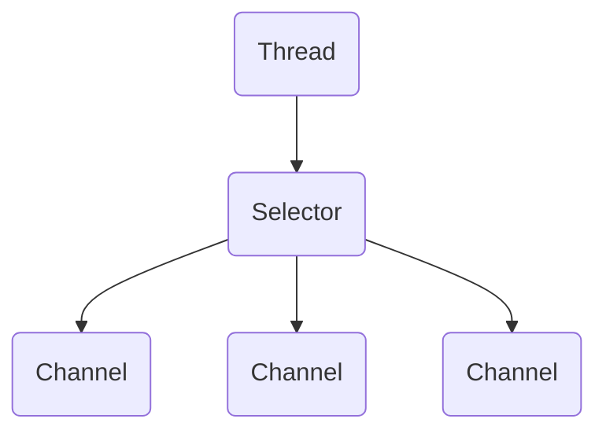
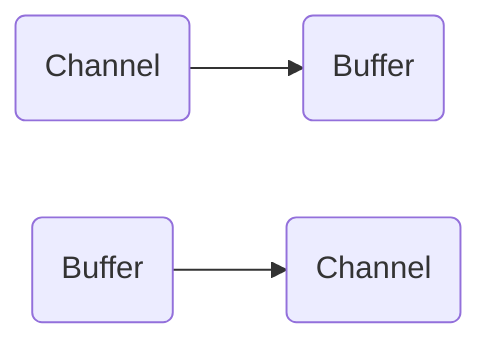
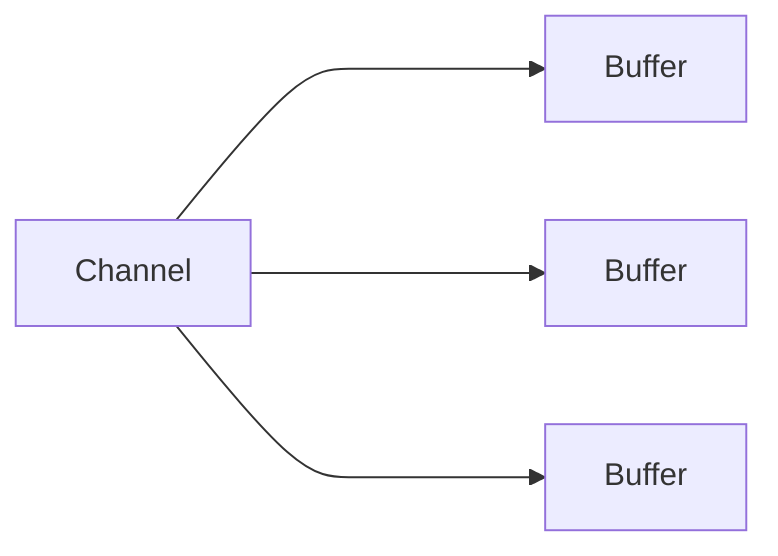
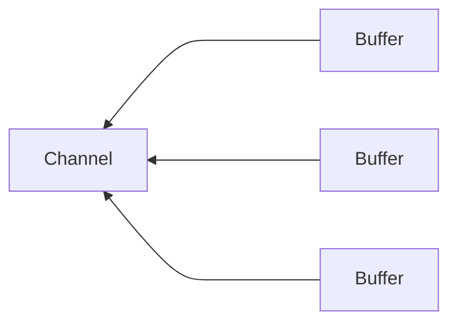

## 一 概述

Java NIO由以下几个核心部分组成：

- Channels
- Buffers
- Selectors

除此之外还有很多类和组件，不过这三个构成核心的API。其他组件只不过与三个核心组件共同使用的工具类。

**Channel和Buffer**

基本上，所有的IO在NIO中都从一个Channel开始。数据可以从Channel读到Buffer中，可以从Buffer写到Channel中。


Channel和Buffer有好几种类型。下面是Java NIO中的一些主要Channel的实现：

- FileChannel
- DatagramChannel
- SocketChannel
- ServerSocketChannel

这些通道涵盖了UDP和TCP网络IO，以及文件IO。

以下是Java NIO里关键的Buffer实现：

- ByteBuffer
- CharBuffer
- DoubleBuffer
- FloatBuffer
- IntBuffer
- LongBuffer
- ShortBuffer

这些Buffer覆盖了你能通过IO发送的基本数据类型：byte, short, int, long, float, double和char。

Java NIO还有个MapperByteBuffer，用于表示内存映射文件。

**Selector**

Selector允许单线程处理多个Channel。如果应用打开了多个连接（通道），但每个连接的流量都很低，使用Selector就会很方便。



要使用Selector，得向Selector注册Channel，然后调用他的select()方法。这个方法会一直阻塞到某个注册的通道有事件就绪。一旦这个方法返回，线程就可以处理这些事件。

## 二 Channel

Java NIO的通道类似流，但又有些不同：

- 既可以从通道中读取数据，又可以写数据到通道。但流的读写通常是单向的。
- 通道可以异步地读写。
- 通道中的数据总是要先读到一个Buffer，或者总是要从一个Buffer中写入。

从通道读取数据到缓冲区，从缓冲区写入数据到通道。



**Channel的实现**

- FileChannel
- DatagramChannel
- SocketChannel
- ServerSocketChannel

FileChannel从文件中读写数据。

DatagramChannel能通过UDP读写网络中的数据。

SocketChannel能通过TCP读写网络中的数据。

ServerSocketChannel可以监听新进来的TCP连接。对每一个新进来的连接都会创建一个SocketChannel。

**基本的Channel示例**

```java
import java.io.RandomAccessFile;
import java.nio.ByteBuffer;
import java.nio.channels.FileChannel;

public class test {
    public static void main(String[] args) throws Exception{
        RandomAccessFile aFile = new RandomAccessFile("temp.txt", "rw");
        FileChannel inChannel = aFile.getChannel();
        ByteBuffer buf = ByteBuffer.allocate(48);
        int bytesRead = inChannel.read(buf);
        while (bytesRead != -1){
            System.out.println("Read " + bytesRead);
            buf.flip();
            while(buf.hasRemaining()) {
                System.out.print((char) buf.get());
            }
            buf.clear();
            bytesRead = inChannel.read(buf);
        }
        aFile.close();
    }
}
```

注意buf.flip()的调用，首先读取数据到Buffer，然后反转Buffer，接着再从Buffer中读取数据。

## 三 Buffer

Java NIO中的Buffer用于和NIO通道进行交互。数据是从通道读入缓冲区，从缓冲区写入到通道中的。

缓冲区本质上是一块可以写入数据，然后可以从中读取数据的内存。这块内存被包装成NIO Buffer对象，并提供了一组方法，用来方便的访问该块内存。

**Buffer的基本用法**

使用Buffer读写数据一般遵循以下四个步骤：

1. 写入数据到Buffer
2. 调用filp()方法
3. 从Buffer中读取数据
4. 调用clear()方法或者compact()方法

当向buffer写入数据时，buffer会记录下写入了多少数据。一旦要读取数据，需要通过flip()方法将Buffer从写模式切换到读模式。在读模式下，可以读取之前写入到Buffer的所有数据。

一旦读完了所有的数据，就需要清空缓冲区，让他可以再次被写入。有两种方式能清空缓冲区：调用clear()或compact()方法。clear()方法会清空整个缓冲区。compact()方法只会清除已经读过的数据。任何未读的数据都被移到缓冲区的起始处，新写入的数据将放到缓冲区未读数据的后面。

**Buffer的capacity, position和limit**

position和limit的含义取决于Buffer处在读模式还是写模式。不管Buffer处在什么模式，capacity的含义总是一样的。

**capacity**

作为一个内存块，Buffer有一个固定的大小值，也叫“capacity”。你只能往里写capacity个byte、long、char等类型。一旦Buffer满了，需要将其清空（通过读数据或者清除数据）才能继续往里写数据。

**position**

当你写数据到Buffer中时，position表示当前的位置。初始的position值为0.当一个byte、long等数据写到Buffer后，position会向前移动到下一个可插入数据的Buffer单元。position最大可为capacity-1。

当读取数据时，也是从某个特定位置读。当将Buffer从写模式切换到读模式，position会被重置为0。当从Buffer的position处读取数据时，position向前移动到下一个可读的位置。

**limit**

在写模式下，Buffer的limit表示你最多能往Buffer里写多少数据。写模式下，limit等于Buffer的capacity。当切换Buffer到读模式时，limit表示你最多能读到多少数据。因此，当切换Buffer到读模式时，limit会被设置成写模式下的position值。你能读到之前写入的写入的所有数据（limit被设置成已写数据的数量，这个值在写模式下就是position）

**Buffer的类型**

Java NIO有以下Buffer类型：

- ByteBuffer
- MapperByteBuffer
- CharBuffer
- DoubleBuffer
- FloatBuffer
- IntBuffer
- LongBuffer
- ShortBuffer

**Buffer的分配**

获得一个Buffer对象首先要进行分配。每个Buffer类都有一个allocate方法。

```java
ByteBuffer buf = ByteBuffer.allocate(48);
```

```java
CharBuffer buf = CharBuffer.allocate(1024);
```

**向Buffer中写数据**

写数据到Buffer有两种方式：

- 从Channel写到Buffer。

  ```java
  int bytesRead = inChannel.read(buf); //read into buffer
  ```

- 通过Buffer的put方法写到Buffer里。

  ```java
  but.put(127);
  ```

**filp()方法**

flip方法将Buffer从写模式切换到读模式。调用flip方法会将position设回0，并将limit设置成之前position的值。换句话说，position现在用于标记读的位置，limit表示之前写进了多少byte、char等--现在能读取多少byte、char等。

**从Buffer中读取数据**

1. 从Buffer读取数据到Channel

   ```java
   //read from buffer into channel
   int byteWritten = inChannel.write(buf);
   ```

2. 使用get()方法从Buffer中读取数据

   ```java
   byte aByte = buf.get();
   ```

**rewind()方法**

Buffer.rewind()将position设回0，所以可以重读Buffer中的所有数据。limit保持不变，仍表示能从Buffer中读取多少个元素。

**clear()与compact()方法**

一旦读完Buffer中的数据，需要让Buffer准备好再次被写入。可以通过clear()或compact()方法来完成。

如果调用的是clear()方法，position将被设回0，limit被设置成 capacity的值。换句话说，Buffer 被清空了。Buffer中的数据并未清除，只是这些标记告诉我们可以从哪里开始往Buffer里写数据。

如果Buffer中有一些未读的数据，调用clear()方法，数据将“被遗忘”，意味着不再有任何标记会告诉你哪些数据被读过，哪些还没有。

如果Buffer中仍有未读的数据，且后续还需要这些数据，但是此时想要先先写些数据，那么使用compact()方法。

compact()方法将所有未读的数据拷贝到Buffer起始处。然后将position设到最后一个未读元素正后面。limit属性依然像clear()方法一样，设置成capacity。现在Buffer准备好写数据了，但是不会覆盖未读的数据。

**mark()与reset()方法**

通过调用Buffer.mark()方法，可以标记Buffer中的一个特定position。之后可以通过调用Buffer.reset()方法恢复到这个position。

```java
buffer.mark();
//call buffer.get() a couple of times, e.g. during parsing
buffer.reset(); //set position back to mark
```

**equals()与compareTo()方法**

equals()

当满足下列条件时，表示两个Buffer相等：

- 有相同的类型（byte、char、int等）
- Buffer中剩余的byte、char等的个数相等
- Buffer中所有剩余的byte、char等都相同

compareTo()

- 第一个不相等的元素小于另一个Buffer中对应的元素
- 所有元素都相等，但第一个Buffer比另一个先耗尽（第一个Buffer的元素个数比另一个少）

## 四 Scatter/Gatter

Java NIO开始支持scatter/gather，scatter/gather用于描述从Channel中读取或者写入到Channel的操作。
分散（scatter）从Channel中读取是指在读操作时将读取的数据写入多个buffer中。因此，Channel将从Channel中读取的数据“分散（scatter）”到多个Buffer中。
聚集（gather）写入Channel是指在写操作时将多个buffer的数据写入同一个Channel，因此，Channel 将多个Buffer中的数据“聚集（gather）”后发送到Channel。

scatter / gather经常用于需要将传输的数据分开处理的场合，例如传输一个由消息头和消息体组成的消息，你可能会将消息体和消息头分散到不同的buffer中，这样你可以方便的处理消息头和消息体。

**Scattering Reads**

Scattering Reads是指数据从一个channel读取到多个buffer中。



```java
ByteBuffer header = ByteBuffer.allocate(128);
ByteBuffer body = ByteBuffer.allocate(1024);
ByteBuffer[] bufferArray = {header, body};
channel.read(bufferArray);
```

注意buffer首先被插入到数组，然后再将数组作为channel.read() 的输入参数。read()方法按照buffer在数组中的顺序将从channel中读取的数据写入到buffer，当一个buffer被写满后，channel紧接着向另一个buffer中写。

Scattering Reads在移动下一个buffer前，必须填满当前的buffer，这也意味着它不适用于动态消息。换句话说，如果存在消息头和消息体，消息头必须完成填充（例如 128byte），Scattering Reads才能正常工作。

**Gattering Writes**

Gattering Writes是指数据从多个buffer写入到同一个channel



```java
ByteBuffer header = ByteBuffer.allocate(128);
ByteBuffer body = ByteBuffer.allocate(1024);
//write data into buffers
ByteBuffer[] bufferArray = {header,body};
channel.write(bufferArray);
```

buffers数组是write()方法的入参，write()方法会按照buffer在数组中的顺序，将数据写入到channel，注意只有position和limit之间的数据才会被写入。因此，如果一个buffer的容量为128byte，但是仅仅包含58byte的数据，那么这58byte的数据将被写入到channel中。因此与Scattering Reads相反，Gathering Writes能较好的处理动态消息。

## 五 通道之间的数据传输

在Java NIO中，如果两个通道中有一个是FileChannel，那你可以直接将数据从一个channel传输到另外一个channel。

**transferFrom()**

FileChannel的transferFrom()方法可以将数据从源通道传输到FileChannel中（这个方法在JDK文档中的解释为将字节从给定的可读取字节通道传输到此通道的文件中）。

```java
RandomAccessFile  fromFile = new RandomAccessFile("fromFile.txt","rw");
FileChannel fromChannel = fromFile.getChannel();
RandomAccessFile toFile = new RandomAccessFile("toFile.txt","rw");
FileChannel toChannel = toFile.getChannel();
long position = 0;
long count = fromChannel.size();
toChannel.transferFrom(position,count,fromChannel);
```

方法的输入参数position表示从position处开始向目标文件写入数据，count表示最多传输的字节数。如果源通道的剩余空间小于 count 个字节，则所传输的字节数要小于请求的字节数。

在SoketChannel的实现中，SocketChannel只会传输此刻准备好的数据（可能不足count字节）。因此，SocketChannel可能不会将请求的所有数据(count个字节)全部传输到FileChannel中。

**transferTo()**

transferTo()方法将数据从FileChannel传输到其他的channel中。

```java
RandomAccessFile fromFile = new RandomAccessFile("fromFile.txt","rw");
FileChannel fromChannel = fromFile.getChannel();
RandomAccessFile toFile = new RandomAccessFile("toFile.txt","rw");
FileChannel toChannel = toFile.getChannel();
long position = 0;
long count = fromChannel.size();
fromChannel.transferTo(position,count,toChannel);
```

关于SocketChannel的问题在transferTo()方法中同样存在。SocketChannel会一直传输数据直到目标buffer被填满。

## 六 Selector

Selector（选择器）是Java NIO中能够检测一到多个NIO通道，并能够知晓通道是否为诸如读写事件做好准备的组件。这样，一个单独的线程可以管理多个channel，从而管理多个网络连接。

仅用单个线程来处理多个Channels的好处是，只需要更少的线程来处理通道。事实上，可以只用一个线程处理所有的通道。对于操作系统来说，线程之间上下文切换的开销很大，而且每个线程都要占用系统的一些资源（如内存）。因此，使用的线程越少越好。但是，现代的操作系统和CPU在多任务方面表现的越来越好，所以多线程的开销随着时间的推移，变得越来越小了。实际上，如果一个CPU有多个内核，不使用多任务可能是在浪费CPU能力。

**Selector的创建**

```java
Selector selector = Selector.open();
```

**向Selector注册通道**

```java
channel.configureBlocking(false);
SelectionKey key = channel.register(selector,SelectionKey.OP_READ);
```

与Selector一起使用时，Channel必须处于非阻塞模式下。这意味着不能将FileChannel与Selector一起使用，因为FileChannel不能切换到非阻塞模式。而套接字通道都可以。

注意register()方法的第二个参数。这是一个“interest集合”，意思是在通过Selector监听Channel时对什么事件感兴趣。可以监听四种不同类型的事件：

1. Connect
2. Accept
3. Read
4. Write

通道触发了一个事件意思是该事件已经就绪。所以，某个channel成功连接到另一个服务器称为“连接就绪”。一个server socket channel准备好接收新进入的连接称为“接收就绪”。一个有数据可读的通道可以说是“读就绪”。等待写数据的通道可以说是“写就绪”。

这四种事件用SelectionKey的四个常量来表示：

1. SelectionKey.OP_CONNECT
2. SelectionKey.OP_ACCEPT
3. SelectionKey.OP_READ
4. SelectionKey.OP_WRITE

如果你对不止一种事件感兴趣，那么可以用“位或”操作符将常量连接起来

```java
int interestSet = SelectionKey.OP_READ | SelectionKey.OP_WRITE;
```

**SelectionKey**

当向Selector注册Channel时，register()方法会返回一个SelectionKey对象。

interest集合

interest集合是你所选择的感兴趣的事件集合。可以通过SelectionKey读写interest集合

```java
int interestSet = selectionKey.interestOps();

boolean isInterestedInAccept  = (interestSet & SelectionKey.OP_ACCEPT) == SelectionKey.OP_ACCEPT；
boolean isInterestedInConnect = interestSet & SelectionKey.OP_CONNECT;
boolean isInterestedInRead    = interestSet & SelectionKey.OP_READ;
boolean isInterestedInWrite   = interestSet & SelectionKey.OP_WRITE;
```

**ready集合**

ready 集合是通道已经准备就绪的操作的集合。在一次选择(Selection)之后，你会首先访问这个ready set。

```java
int readySet = selectionKey.readyOps();
//selectionKey.isAcceptable();
//selectionKey.isConnectable();
//selectionKey.isReadable();
//selectionKey.isWritable();
```

**Channel+Selector**

```java
Channel  channel  = selectionKey.channel();
Selector selector = selectionKey.selector();
```

**附加的对象**

可以将一个对象或者更多信息附着到SelectionKey上，这样就能方便的识别某个给定的通道。

```java
selectionKey.attach(theObject);
Object attachedObj = selectionKey.attachment();
```

还可以在用register()方法向Selector注册Channel的时候附加对象。

```java
SelectionKey key = channel.register(selector, SelectionKey.OP_READ, theObject);
```

**通过Selector选择通道**

一旦向Selector注册了一或多个通道，就可以调用几个重载的select()方法。这些方法返回你所感兴趣的事件（如连接、接受、读或写）已经准备就绪的那些通道。

select()阻塞到至少有一个通道在你注册的事件上就绪了。

select(long timeout)和select()一样，除了最长会阻塞timeout毫秒(参数)。

selectNow()不会阻塞，不管什么通道就绪都立刻返回（此方法执行非阻塞的选择操作。如果自从前一次选择操作后，没有通道变成可选择的，则此方法直接返回零。）

select()方法返回的int值表示有多少通道已经就绪。亦即，自上次调用select()方法后有多少通道变成就绪状态。如果调用select()方法，因为有一个通道变成就绪状态，返回了1，若再次调用select()方法，如果另一个通道就绪了，它会再次返回1。如果对第一个就绪的channel没有做任何操作，现在就有两个就绪的通道，但在每次select()方法调用之间，只有一个通道就绪了。

**selectedKeys()**

一旦调用了select()方法，并且返回值表明有一个或更多个通道就绪了，然后可以通过调用selector的selectedKeys()方法，访问“已选择键集（selected key set）”中的就绪通道。

```java
Set selectedKeys = selector.selectedKeys();
```

当像Selector注册Channel时，Channel.register()方法会返回一个SelectionKey 对象。这个对象代表了注册到该Selector的通道。可以通过SelectionKey的selectedKeySet()方法访问这些对象。

可以遍历这个已选择的键集合来访问就绪的通道。

```java
Set selectedKeys = selector.selectedKeys();
Iterator keyIterator = selectedKeys.iterator();
while(keyIterator.hasNext()) {
    SelectionKey key = keyIterator.next();
    if(key.isAcceptable()) {
        // a connection was accepted by a ServerSocketChannel.
    } else if (key.isConnectable()) {
        // a connection was established with a remote server.
    } else if (key.isReadable()) {
        // a channel is ready for reading
    } else if (key.isWritable()) {
        // a channel is ready for writing
    }
    keyIterator.remove();
}
```

这个循环遍历已选择键集中的每个键，并检测各个键所对应的通道的就绪事件。

注意每次迭代末尾的keyIterator.remove()调用。Selector不会自己从已选择键集中移除SelectionKey实例。必须在处理完通道时自己移除。下次该通道变成就绪时，Selector会再次将其放入已选择键集中。

SelectionKey.channel()方法返回的通道需要转型成你要处理的类型，如ServerSocketChannel或SocketChannel等。

**wakeUp()**

某个线程调用select()方法后阻塞了，即使没有通道已经就绪，也有办法让其从select()方法返回。只要让其它线程在第一个线程调用select()方法的那个对象上调用Selector.wakeup()方法即可。阻塞在select()方法上的线程会立马返回。

如果有其它线程调用了wakeup()方法，但当前没有线程阻塞在select()方法上，下个调用select()方法的线程会立即“醒来（wake up）”。

**close()**

用完Selector后调用其close()方法会关闭该Selector，且使注册到该Selector上的所有SelectionKey实例无效。通道本身并不会关闭。

```java
Selector selector = Selector.open();
channel.configureBlocking(false);
SelectionKey key = channel.register(selector, SelectionKey.OP_READ);
while(true) {
  int readyChannels = selector.select();
  if(readyChannels == 0) continue;
  Set selectedKeys = selector.selectedKeys();
  Iterator keyIterator = selectedKeys.iterator();
  while(keyIterator.hasNext()) {
    SelectionKey key = keyIterator.next();
    if(key.isAcceptable()) {
        // a connection was accepted by a ServerSocketChannel.
    } else if (key.isConnectable()) {
        // a connection was established with a remote server.
    } else if (key.isReadable()) {
        // a channel is ready for reading
    } else if (key.isWritable()) {
        // a channel is ready for writing
    }
    keyIterator.remove();
  }
}
```

## 七 FileChannel

Java NIO中的FileChannel是一个连接到文件的通道。可以通过文件通道读写文件。

FileChannel无法设置为非阻塞模式，它总是运行在阻塞模式下。

**打开FileChannel**

在使用FileChannel之前，必须先打开它。但是，我们无法直接打开一个FileChannel，需要通过使用一个InputStream、OutputStream或RandomAccessFile来获取一个FileChannel实例。

```java
RandomAccessFile aFile = new RandomAccessFile("data/nio-data.txt", "rw");
FileChannel inChannel = aFile.getChannel();
```

**从FileChannel读取数据**

调用多个read()方法之一从FileChannel中读取数据。

```java
ByteBuffer buf = ByteBuffer.allocate(48);
int bytesRead = inChannel.read(buf);
```

**向FileChannel写数据**

使用FileChannel.write()方法向FileChannel写数据，该方法的参数是一个Buffer。

```java
String newData = "New String to write to file..." + System.currentTimeMillis();

ByteBuffer buf = ByteBuffer.allocate(48);
buf.clear();
buf.put(newData.getBytes());

buf.flip();

while(buf.hasRemaining()) {
	channel.write(buf);
}
```

FileChannel.write()是在while循环中调用的。因为无法保证write()方法一次能向FileChannel写入多少字节，因此需要重复调用write()方法，直到Buffer中已经没有尚未写入通道的字节。

**关闭FileChannel**

```java
channel.close();
```

**FileChannel的position方法**

可以通过调用position()方法获取FileChannel的当前位置。

也可以通过调用position(long pos)方法设置FileChannel的当前位置。

```java
long pos = channel.position();
channel.position(pos+123);
```

如果将位置设置在文件结束符之后，然后试图从文件通道中读取数据，读方法将返回-1 —— 文件结束标志。

如果将位置设置在文件结束符之后，然后向通道中写数据，文件将撑大到当前位置并写入数据。这可能导致“文件空洞”，磁盘上物理文件中写入的数据间有空隙。

**FileChannel的size方法**

返回该实例所关联文件的大小。

```java
long fileSize = channel.size();
```

**FileChannel的truncate方法**

可以使用FileChannel.truncate()方法截取一个文件。截取文件时，文件将中指定长度后面的部分将被删除。

```java
channel.truncate(1024);
```

**FileChannel的force方法**

FileChannel.force()方法将通道里尚未写入磁盘的数据强制写到磁盘上。出于性能方面的考虑，操作系统会将数据缓存在内存中，所以无法保证写入到FileChannel里的数据一定会即时写到磁盘上。要保证这一点，需要调用force()方法。

force()方法有一个boolean类型的参数，指明是否同时将文件元数据（权限信息等）写到磁盘上。

```java
channel.force(true);
```

## 八 SocketChannel

Java NIO中的SocketChannel是一个连接到TCP网络套接字的通道。可以通过以下2种方式创建SocketChannel：

1. 打开一个SocketChannel并连接到互联网上的某台服务器。
2. 一个新连接到达ServerSocketChannel时，会创建一个SocketChannel。

**打开SocketChannel**

```java
SocketChannel socketChannel = SocketChannel.open();
socketChannel.connect(new InetSocketAddress("http://kenkov.com",80));
```

**关闭SocketChannel**

```java
socketChannel.close();
```

**从SocketChannel读取数据**

```java
ByteBuffer buf = ByteBuffer.allocate(48);
int bytesRead = socketChannel.read(buf);
```

**写入SocketChannel**

```java
String newData = "New String to write to file..." + System.currentTimeMillis();

ByteBuffer buf = ByteBuffer.allocate(48);
buf.clear();
buf.put(newData.getBytes());

buf.flip();

while(buf.hasRemaining()) {
    channel.write(buf);
}
```

**非阻塞模式**

可以设置 SocketChannel 为非阻塞模式（non-blocking mode）.设置之后，就可以在异步模式下调用connect(), read() 和write()。

connect()

如果SocketChannel在非阻塞模式下，此时调用connect()，该方法可能在连接建立之前就返回了。为了确定连接是否建立，可以调用finishConnect()的方法。

```java
socketChannel.configureBlocking(false);
socketChannel.connect(new InetSocketAddress("http://jenkov.com", 80));

while(! socketChannel.finishConnect() ){
    //wait, or do something else...
}
```

write()

非阻塞模式下，write()方法在尚未写出任何内容时可能就返回了。所以需要在循环中调用write()。

read()

非阻塞模式下,read()方法在尚未读取到任何数据时可能就返回了。所以需要关注它的int返回值，它会告诉你读取了多少字节。

**非阻塞模式与选择器**

非阻塞模式与选择器搭配会工作的更好，通过将一或多个SocketChannel注册到Selector，可以询问选择器哪个通道已经准备好了读取，写入等

## 九 ServerSocketChannel

Java NIO中的 ServerSocketChannel 是一个可以监听新进来的TCP连接的通道, 就像标准IO中的ServerSocket一样。

**打开ServerSocketChannel**

```java
ServerSocketChannel serverSocketChannel = ServerSocketChannel.open();
```

**关闭SServerSocketChannel**

```java
serverSocketChannel.close();
```

**监听新进来的连接**

通过 ServerSocketChannel.accept() 方法监听新进来的连接。当 accept()方法返回的时候,它返回一个包含新进来的连接的 SocketChannel。因此, accept()方法会一直阻塞到有新连接到达。

通常不会仅仅只监听一个连接,在while循环中调用 accept()方法。

```java
while(true){
    SocketChannel socketChannel =
            serverSocketChannel.accept();
    //do something with socketChannel...
}
```

**非阻塞模式**

ServerSocketChannel可以设置成非阻塞模式。在非阻塞模式下，accept() 方法会立刻返回，如果还没有新进来的连接,返回的将是null。 因此，需要检查返回的SocketChannel是否是null。

```java
ServerSocketChannel serverSocketChannel = ServerSocketChannel.open();

serverSocketChannel.socket().bind(new InetSocketAddress(9999));
serverSocketChannel.configureBlocking(false);

while(true){
    SocketChannel socketChannel =
            serverSocketChannel.accept();

    if(socketChannel != null){
        //do something with socketChannel...
    }
}
```

## 十 DatagramChannel

Java NIO中的DatagramChannel是一个能收发UDP包的通道。因为UDP是无连接的网络协议，所以不能像其它通道那样读取和写入。它发送和接收的是数据包。

**打开DatagramChannel**

```java
DatagramChannel channel = DatagramChannel.open();
channel.socket().bind(new InetSocketAddress(9999));
```

**接收数据**

```java
ByteBuffer buf = ByteBuffer.allocate(48);
buf.clear();
channel.receive(buf);
```

receive()方法会将接收到的数据包内容复制到指定的Buffer. 如果Buffer容不下收到的数据，多出的数据将被丢弃。

**发送数据**

```java
String newData = "New String to write to file..." + System.currentTimeMillis();

ByteBuffer buf = ByteBuffer.allocate(48);
buf.clear();
buf.put(newData.getBytes());
buf.flip();

int bytesSent = channel.send(buf, new InetSocketAddress("jenkov.com", 80));
```

因为服务端并没有监控这个端口，所以什么也不会发生。也不会通知你发出的数据包是否已收到，因为UDP在数据传送方面没有任何保证。

**连接到特定的地址**

可以将DatagramChannel“连接”到网络中的特定地址的。由于UDP是无连接的，连接到特定地址并不会像TCP通道那样创建一个真正的连接。而是锁住DatagramChannel ，让其只能从特定地址收发数据。

```java
channel.connect(new InetSocketAddress("jenkov.com",80));
```

当连接后，也可以使用read()和write()方法，就像在用传统的通道一样。只是在数据传送方面没有任何保证。

```java
int bytesRead = channel.read(buf);
int bytesWritten = channel.write(but);
```

## 十一 Pipe

Java NIO 管道是2个线程之间的单向数据连接。Pipe有一个source通道和一个sink通道。数据会被写到sink通道，从source通道读取。


**创建管道**

```java
Pipe pipe = Pipe.open();
```

**向管道写数据**

向管道写数据，需要访问sink通道

```java
Pipe.SinkChannel sinkChannel = pipe.sink();
```

通过调用SinkChannel的write()方法，将数据写入SinkChannel

```java
String newData = "New String to write to file..." + System.currentTimeMillis();
ByteBuffer buf = ByteBuffer.allocate(48);
buf.clear();
buf.put(newData.getBytes());

buf.flip();

while(buf.hasRemaining()) {
    sinkChannel.write(buf);
}

```

**从管道读取数据**

从管道读取数据，需要访问source通道

```java
Pipe.SourceChannel sourceChannel = pipe.source();
```

调用source通道的read()方法来读取数据

```java
ByteBuffer buf = ByteBuffer.allocate(48);
int bytesRead = sourceChannel.read(buf);
```

read()方法返回多少字节被读进了缓冲区。

## 十二 Java NIO与IO

主要差别

|   IO   |   NIO    |
| :----: | :------: |
| 面向流 | 面向缓冲 |
| 阻塞IO | 非阻塞IO |
|   无   |  选择器  |

**面向流与面向缓冲**

Java IO面向流意味着每次从流中读一个或多个字节，直至读取所有字节，它们没有被缓存在任何地方。此外，它不能前后移动流中的数据。如果需要前后移动从流中读取的数据，需要先将它缓存到一个缓冲区。 Java NIO的缓冲导向方法略有不同。数据读取到一个它稍后处理的缓冲区，需要时可在缓冲区中前后移动。这就增加了处理过程中的灵活性。但是，还需要检查是否该缓冲区中包含所有需要处理的数据。而且，需确保当更多的数据读入缓冲区时，不要覆盖缓冲区里尚未处理的数据。

**阻塞IO与非阻塞IO**

Java IO的各种流是阻塞的。这意味着，当一个线程调用read() 或 write()时，该线程被阻塞，直到有一些数据被读取，或数据完全写入。该线程在此期间不能再干任何事情了。 Java NIO的非阻塞模式，使一个线程从某通道发送请求读取数据，但是它仅能得到目前可用的数据，如果目前没有数据可用时，就什么都不会获取。而不是保持线程阻塞，所以直至数据变的可以读取之前，该线程可以继续做其他的事情。 非阻塞写也是如此。一个线程请求写入一些数据到某通道，但不需要等待它完全写入，这个线程同时可以去做别的事情。 线程通常将非阻塞IO的空闲时间用于在其它通道上执行IO操作，所以一个单独的线程现在可以管理多个输入和输出通道（channel）。

**选择器Selectors**

ava NIO的选择器允许一个单独的线程来监视多个输入通道，可以注册多个通道使用一个选择器，然后使用一个单独的线程来“选择”通道：这些通道里已经有可以处理的输入，或者选择已准备写入的通道。这种选择机制，使得一个单独的线程很容易来管理多个通道。

**API调用**

使用NIO的API调用时看起来与使用IO时有所不同，但这并不意外，因为并不是仅从一个InputStream逐字节读取，而是数据必须先读入缓冲区再处理。

**数据处理**

在IO设计中，我们从InputStream或 Reader逐字节读取数据。

```java
BufferedReader reader = new BufferedReader(new InputStreamReader(input));

String nameLine   = reader.readLine();
String ageLine    = reader.readLine();
String emailLine  = reader.readLine();
String phoneLine  = reader.readLine();
```

仅在有新数据读入时运行，并知道每步的数据是什么。一旦正在运行的线程已处理过读入的某些数据，该线程不会再回退数据（大多如此）。

一个NIO的实现会有所不同,在知道所有数据都在缓冲区里之前，必须检查几次缓冲区的数据。这不仅效率低下，而且可以使程序设计方案杂乱不堪。

```java
ByteBuffer buffer = ByteBuffer.allocate(48);
int bytesRead = inChannel.read(buffer);
while(!bufferFull(byteRead)){
    bytesRead = inChannel.read(buffer);
}
```

bufferFull()方法必须跟踪有多少数据读入缓冲区，并返回真或假，这取决于缓冲区是否已满。换句话说，如果缓冲区准备好被处理，那么表示缓冲区满了。

bufferFull()方法扫描缓冲区，但必须保持在bufferFull（）方法被调用之前状态相同。如果没有，下一个读入缓冲区的数据可能无法读到正确的位置。这是不可能的，但却是需要注意的又一问题。

如果缓冲区已满，它可以被处理。如果它不满，并且在你的实际案例中有意义，你或许能处理其中的部分数据。但是许多情况下并非如此。

Java NIO：从一个通道里读数据，直到所有的数据都读到缓冲区里。

**用来处理数据的线程数**

NIO可让您只使用一个（或几个）单线程管理多个通道（网络连接或文件），但付出的代价是解析数据可能会比从一个阻塞流中读取数据更复杂。

如果需要管理同时打开的成千上万个连接，这些连接每次只是发送少量的数据，实现NIO的服务器可能是一个优势。如果需要维持许多打开的连接到其他计算机上，使用一个单独的线程来管理你所有出站连接，可能是一个优势。

Java NIO：单线程管理多个连接

如果你有少量的连接使用非常高的带宽，一次发送大量的数据，也许典型的IO服务器实现可能非常契合。

Java IO：一个典型的IO服务器设计-一个连接通过一个线程处理

## 十三 Java NIO Path

**创建Path实例**

```java
Path path = Paths.get("c:\\data\myfile.txt");
```

**Path.normalize()**

Path 的normalize()方法可以标准化路径。标准化的含义是路径中的.和..都被去掉，指向真正的路径目录地址。

## 十四 Java NIO File

**Files.exist()**

Files.exists()方法用来检查文件系统中是否存在某路径。

```java
Path path = Paths.get("data/logging.properties");
boolean pathExists = Files.exist(path,Files.exists(path,new LinkOption[]{LinkOption.NOFOLLOW_LINKS}));
//表示path路径中如果有连接，Files.exists方法不会跟进到连接中去
```

## 十五 Java NIO AsynchronousFileChannel

在 Java 7 中，AsynchronousFileChannel被添加到 Java NIO。这AsynchronousFileChannel使得异步读取数据和将数据写入文件成为可能。

**创建一个异步文件通道**

```java
Path path = Paths.get("data/test.xml");
AsynchronousFileChannel fileChannel = AsynchronousFileChannel.open(path, StandardOpenOption.READ);
```

**通过Future读取数据**

```java
AsynchronousFileChannel fileChannel = 
    AsynchronousFileChannel.open(path, StandardOpenOption.READ);

ByteBuffer buffer = ByteBuffer.allocate(1024);
long position = 0;

Future<Integer> operation = fileChannel.read(buffer, position);

while(!operation.isDone());

buffer.flip();
byte[] data = new byte[buffer.limit()];
buffer.get(data);
System.out.println(new String(data));
buffer.clear();
```

**通过 CompletionHandler 读取数据**

```java
fileChannel.read(buffer, position, buffer, new CompletionHandler<Integer, ByteBuffer>() {
    @Override
    public void completed(Integer result, ByteBuffer attachment) {
        System.out.println("result = " + result);

        attachment.flip();
        byte[] data = new byte[attachment.limit()];
        attachment.get(data);
        System.out.println(new String(data));
        attachment.clear();
    }

    @Override
    public void failed(Throwable exc, ByteBuffer attachment) {

    }
});
```

**通过Future写入数据**

```java
Path path = Paths.get("data/test-write.txt");
AsynchronousFileChannel fileChannel = 
    AsynchronousFileChannel.open(path, StandardOpenOption.WRITE);

ByteBuffer buffer = ByteBuffer.allocate(1024);
long position = 0;

buffer.put("test data".getBytes());
buffer.flip();

Future<Integer> operation = fileChannel.write(buffer, position);
buffer.clear();

while(!operation.isDone());

System.out.println("Write done");
```

**通过CompletionHandler写入数据**

```java
Path path = Paths.get("data/test-write.txt");
if(!Files.exists(path)){
    Files.createFile(path);
}
AsynchronousFileChannel fileChannel = 
    AsynchronousFileChannel.open(path, StandardOpenOption.WRITE);

ByteBuffer buffer = ByteBuffer.allocate(1024);
long position = 0;

buffer.put("test data".getBytes());
buffer.flip();

fileChannel.write(buffer, position, buffer, new CompletionHandler<Integer, ByteBuffer>() {

    @Override
    public void completed(Integer result, ByteBuffer attachment) {
        System.out.println("bytes written: " + result);
    }

    @Override
    public void failed(Throwable exc, ByteBuffer attachment) {
        System.out.println("Write failed");
        exc.printStackTrace();
    }
});
```

