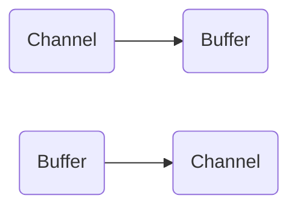
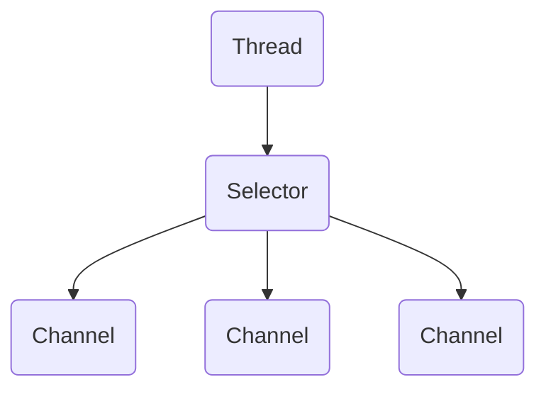

## 一 概述

Java NIO由以下几个核心部分组成：

- Channels
- Buffers
- Selectors

除此之外还有很多类和组件，不过这三个构成核心的API。其他组件只不过与三个核心组件共同使用的工具类。

**Channel和Buffer**

基本上，所有的IO在NIO中都从一个Channel开始。数据可以从Channel读到Buffer中，可以从Buffer写到Channel中。



Channel和Buffer有好几种类型。下面是Java NIO中的一些主要Channel的实现：

- FileChannel
- DatagramChannel
- SocketChannel
- ServerSocketChannel

这些通道涵盖了UDP和TCP网络IO，以及文件IO。

以下是Java NIO里关键的Buffer实现：

- ByteBuffer
- CharBuffer
- DoubleBuffer
- FloatBuffer
- IntBuffer
- LongBuffer
- ShortBuffer

这些Buffer覆盖了你能通过IO发送的基本数据类型：byte, short, int, long, float, double和char。

Java NIO还有个MapperByteBuffer，用于表示内存映射文件。

**Selector**

Selector允许单线程处理多个Channel。如果应用打开了多个连接（通道），但每个连接的流量都很低，使用Selector就会很方便。



要使用Selector，得向Selector注册Channel，然后调用他的select()方法。这个方法会一直阻塞到某个注册的通道有事件就绪。一旦这个方法返回，线程就可以处理这些事件。

## 二 Channel

Java NIO的通道类似流，但又有些不同：

- 既可以从通道中读取数据，又可以写数据到通道。但流的读写通常是单向的。
- 通道可以异步地读写。
- 通道中的数据总是要先读到一个Buffer，或者总是要从一个Buffer中写入。

从通道读取数据到缓冲区，从缓冲区写入数据到通道。


**Channel的实现**

- FileChannel
- DatagramChannel
- SocketChannel
- ServerSocketChannel

FileChannel从文件中读写数据。

DatagramChannel能通过UDP读写网络中的数据。

SocketChannel能通过TCP读写网络中的数据。

ServerSocketChannel可以监听新进来的TCP连接。对每一个新进来的连接都会创建一个SocketChannel。

**基本的Channel示例**

```java
import java.io.RandomAccessFile;
import java.nio.ByteBuffer;
import java.nio.channels.FileChannel;

public class test {
    public static void main(String[] args) throws Exception{
        RandomAccessFile aFile = new RandomAccessFile("temp.txt", "rw");
        FileChannel inChannel = aFile.getChannel();
        ByteBuffer buf = ByteBuffer.allocate(48);
        int bytesRead = inChannel.read(buf);
        while (bytesRead != -1){
            System.out.println("Read " + bytesRead);
            buf.flip();
            while(buf.hasRemaining()) {
                System.out.print((char) buf.get());
            }
            buf.clear();
            bytesRead = inChannel.read(buf);
        }
        aFile.close();
    }
}
```

注意buf.flip()的调用，首先读取数据到Buffer，然后反转Buffer，接着再从Buffer中读取数据。

## 三 Buffer

Java NIO中的Buffer用于和NIO通道进行交互。数据是从通道读入缓冲区，从缓冲区写入到通道中的。

缓冲区本质上是一块可以写入数据，然后可以从中读取数据的内存。这块内存被包装成NIO Buffer对象，并提供了一组方法，用来方便的访问该块内存。

**Buffer的基本用法**

使用Buffer读写数据一般遵循以下四个步骤：

1. 写入数据到Buffer
2. 调用filp()方法
3. 从Buffer中读取数据
4. 调用clear()方法或者compact()方法

当向buffer写入数据时，buffer会记录下写入了多少数据。一旦要读取数据，需要通过flip()方法将Buffer从写模式切换到读模式。在读模式下，可以读取之前写入到Buffer的所有数据。

一旦读完了所有的数据，就需要清空缓冲区，让他可以再次被写入。有两种方式能清空缓冲区：调用clear()或compact()方法。clear()方法会清空整个缓冲区。compact()方法只会清除已经读过的数据。任何未读的数据都被移到缓冲区的起始处，新写入的数据将放到缓冲区未读数据的后面。

**Buffer的capacity, position和limit**

position和limit的含义取决于Buffer处在读模式还是写模式。不管Buffer处在什么模式，capacity的含义总是一样的。

**capacity**

作为一个内存块，Buffer有一个固定的大小值，也叫“capacity”。你只能往里写capacity个byte、long、char等类型。一旦Buffer满了，需要将其清空（通过读数据或者清除数据）才能继续往里写数据。

**position**

当你写数据到Buffer中时，position表示当前的位置。初始的position值为0.当一个byte、long等数据写到Buffer后，position会向前移动到下一个可插入数据的Buffer单元。position最大可为capacity-1。

当读取数据时，也是从某个特定位置读。当将Buffer从写模式切换到读模式，position会被重置为0。当从Buffer的position处读取数据时，position向前移动到下一个可读的位置。

**limit**

在写模式下，Buffer的limit表示你最多能往Buffer里写多少数据。写模式下，limit等于Buffer的capacity。当切换Buffer到读模式时，limit表示你最多能读到多少数据。因此，当切换Buffer到读模式时，limit会被设置成写模式下的position值。你能读到之前写入的写入的所有数据（limit被设置成已写数据的数量，这个值在写模式下就是position）

**Buffer的类型**

Java NIO有以下Buffer类型：

- ByteBuffer
- MapperByteBuffer
- CharBuffer
- DoubleBuffer
- FloatBuffer
- IntBuffer
- LongBuffer
- ShortBuffer

**Buffer的分配**

获得一个Buffer对象首先要进行分配。每个Buffer类都有一个allocate方法。

```java
ByteBuffer buf = ByteBuffer.allocate(48);
```

```java
CharBuffer buf = CharBuffer.allocate(1024);
```

**向Buffer中写数据**

写数据到Buffer有两种方式：

- 从Channel写到Buffer。

  ```java
  int bytesRead = inChannel.read(buf); //read into buffer
  ```

- 通过Buffer的put方法写到Buffer里。

  ```java
  but.put(127);
  ```

**filp()方法**

flip方法将Buffer从写模式切换到读模式。调用flip方法会将position设回0，并将limit设置成之前position的值。换句话说，position现在用于标记读的位置，limit表示之前写进了多少byte、char等--现在能读取多少byte、char等。

**从Buffer中读取数据**

