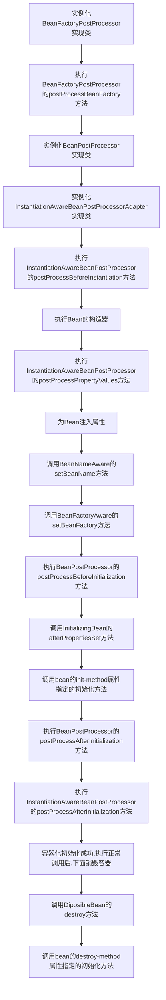

# Spring

## IOC和DI

**IOC:控制反转**

即控制权的转移，将创建对象的方式反转了,以前对象的创建是由开发人员自己维护,包括依赖关系也是自己注入。使用了spring之后，对象的创建以及依赖关系可以由spring完成创建以及注入，反转控制就是反转了对象的创建方式，从我们自己创建反转给了程序创建(spring)

**DI:  Dependency Injection  依赖注入**

spring这个容器中，替你管理着一系列的类，前提是你需要将这些类交给spring容器进行管理，然后在你需要的时候，不是自己去定义，而是直接向spring容器索取，当spring容器知道你的需求之后，就会去它所管理的组件中进行查找，然后直接给你所需要的组件.
实现IOC思想需要DI做支持

注入方式:   1. set方式注入    2. 构造方法注入   3. 字段注入
注入类型:   1. 值类型注入     2. 引用类型注入

> 好处
>
> 1.降低组件之间的耦合度，实现软件各层之间的解耦.

>
> 2.可以使容器提供众多服务如事务管理消息服务处理等等。当我们使用容器管理事务时，开发人员就不需要手工 控制事务，也不需要处理复杂的事务传播
>
> 
3.容器提供单例模式支持，开发人员不需要自己编写实现代码.
>
> 
4.容器提供了AOP技术，利用它很容易实现如权限拦截，运行期监控等功能

>
> 5.容器提供众多的辅佐类，使这些类可以加快应用的开发.如jdbcTemplate HibernateTemplate

## ApplicationContext&BeanFactory的区别

**BeanFactory接口**

1. spring的原始接口，针对原始接口的实现类功能较为单一
2. BeanFactory接口实现类的容器，特点是每次在获得对象时才会创建对象

**ApplicationContext接口**

1. 每次容器启动时就会创建容器中配置的所有对象
2. 提供更多功能
3. 从类路径下加载配置文件：ClassPathXmlApplicationContext
   从硬盘的绝对路径下加载配置文件：FileSystemXmlApplication

## spring bean生命周期




## spring配置详解

### 元素属性

bean元素：使用该元素描述需要spring容器管理对象
name属性：给被管理的对象起个名字，获得对象时getBean("name值")
class属性：被管理对象的完整类名
id属性：与name属性一样，名称不可重复，不能使用特殊字符

==name和id之间的一些注意点==

1. 配置两个相同的id或者name都不能通过
2. 如果既配置了 id ，也配置了 name ，则两个都生效。如果id和name都没有指定，则用类全名作为name，如<bean class="com.stamen.BeanLifeCycleImpl">,则你可以通过getBean("com.stamen.BeanLifeCycleImpl")返回该实例
3. 如果配置基本类的时候，注解和配置文件都使用的时候，注解和配置文件中name相同的时候，则两个冲突，配置文件生效
   如果配置基本类的时候，注解和配置文件都使用的时候，注解和配置文件中name不同的时候，则两个不冲突，都能够生效

### bean元素进阶

1. scope属性

   1. singleton 默认值
      单例对象：被标识为单例的对象在spring容器中只会存在一个实例
   2. prototype
      多例原型：被标识为多例的对象，每次在获得才会被创建，每次创建都是新的对象
   3. request
      Web环境下，对象与request生命周期一致
   4. session
      Web环境下，对象与session生命周期一致

   绝大多数情况下，使用单例singleton，但是在与structs整合时候，务必要用prototype多例，因为structs2在每次请求都会创建一个新的Action,若为单例，在多请求情况下，每个请求找spring拿的都是同一个action

2. 生命周期属性

   1. 配置一个方法作为生命周期初始化方法，spring会在对象创建之后立刻调用init-method
   2. 配置一个方法作为生命周期的销毁方法，spring容器在关闭并销毁所有容器中的对象之前调用destroy-method

   >  <bean init-method="init"  destory-method="destory"></bean>
   >  对应注解为@PostConstruct
   >
   >  <bean name="hello" class="完整类名"></bean>
   >  对应注解为@PreDestory
   >
   >  ```xml
   >  <bean id="xxxx" class="com.xxx.xxx.service.xxxx" init-method="initMethod" destroy-method="destroyMethod"></bean>
   >  ```
   
   ```mermaid
   graph TD
   服务器加载Servlet --> Servlet构造函数 --> PostConstruct注解修饰的方法 --> init方法 --> service方法 --> destroy方法 --> PreDestroy注解修饰的方法 --> 服务器卸载Servlet完毕
   ```
   
3. 模块化配置，即分模块配置（导入其他spring配置文件）

   ~~~xml
   <beans>
   	<import resource = "spring配置文件的全路径名"/>
   </beans>
   ~~~

### spring三种对象的创建方式

1. 空参数构造

   ```xml
   <bean name="hello" class="com.xxx.xxx.xxx.HelloWorld"></bean> 
   ```

2. 静态工厂创建（调用静态方法创建）
   调用UserFactory类的静态createUser方法创建名为user的对象，放入容器

   ```xml
   <bean name="user" class="com.xxx.UserFactory" factory-method="createUser"></bean>
   ```

3. 实例工厂创建（调用非静态方法创建）--需要配置两个bean，因为无法通过类名调用非静态方法

   ```xml
   <bean name="user2" factory-bean="userFactory" factory-method="createUser"></bean>
   <bean name="userFactory" class="com.xxx.UserFactory"></bean>
   ```

### spring注入方式

1. set方式注入--值类型用value注入 引用类型用ref注入

   ```xml
   <bean name="student" class="com.xxx.xxx.xxx.Student">
   	<property name="name" value="张三"></property>
       <property name="teacher" ref="teacher"></property>
   </bean>
   <bean name="teacher" class="com.xxx.xxx.xxx.Teacher"></bean>
   ```

2. 构造方法注入

   ```xml
   <bean name="student2" class="com.xxx.xxx.xxx.Student">
   	<constructor-arg name="name" index="0" type="java.lang.String" value="xxx"></constructor-arg>
       <constructor-arg name="teacher" index="1" ref="teacher"></constructor-arg>
   </bean>
   ```

3. p名称空间注入--实际set注入，spring独有，为了简化<property>写法

   ```xml
   xmlns:p="http://www.springframework.org/schema/p"
   ```

   ```xml
   <bean name="run2" class="cn.itcats.thread.Run" p:name="haha" p:age="20" p:hello-ref="hello"></bean>
   ```

4. spel注入：spring Expression Language spring表达式语言

   ```xml
   <bean name="runSpel" class="cn.itcats.thread.Run">
       <!-- 取bean标签中name为"user"中property为"name"中的value值 --!>
       <property name="name" value="#{user.name}"></property>
   </bean>
   ```

   spel特性：

   1. 使用Bean的ID来引用Bean
   2. 调用方法和访问对象的属性
   3. 对值进行算术、关系和逻辑运算
   4. 正则表达式匹配
   5. 集合操作

5. 复杂类型注入

   1. array数组的注入

      ```xml
      <bean name="cb" class="com.xxx.xxx.xxx.CollectionBean"
            <property name="arr">
      		<array>
      			<value>value1</value>
                  <value>value2</value>
                  <ref bean="teacher"></ref>
      		</array>
      	  </property>
      </bean>
      ```

   2. list集合注入

      ```xml
      <property name="list">
          <list>
          	<value>value1</value>
              <value>value2</value>
              <ref name="teacher"></ref>
          </list>
      </property>
      ```

   3. map集合注入

      ```xml
      <property name="map">
      	<map>
          	<entry key="mapk1" value="mapv1"></entry>
              <entry key="teacher" value-ref="teacher"></entry>
              <entry key-ref="student" value-ref="teacher"></entry>
          </map>
      </property>
      ```

   4. properties的注入

      ```xml
      <property name="prop">
      	<prop key="driverClass">com.jdbc.mysql.Driver</prop>
          <prop key="username">root</prop>
          <prop key="password">root</prop>
      </property>
      ```

### web.xml

防止创建多个ApplicationContext取值、并指定即在spring配置文件的位置--web.xml

1. 需要导入包spring-web
2. 在web.xml中配置监听器

```xml
<listener>
	<listener-class>org.springframework.web.context.ContextLoaderListener</listener-class>
</listener>

<context-param>
	<param-name>contextConfigLocation</param-name>
    <param-value>classpath:applicationContext.xml</param-value>
</context-param>
```

### 用注解方式代替配置文件

1. 在applicationContext.xml中指定扫描

   ```xml
   <context:component-scan base-package="com.xxx.xxx.xxx"></context:component-scan>
   ```

2. 在类中书写Component

   ```java
   //相当于<bean name="student" class="com.xxx.xxx.xxx.Student"/>
   @Component("student")
   	@Service("student")//service层
   	@Controller("student")//web层
   	@Repository("student")//dao层
   ```

3. 指定对象的作用范围Scope

   ```java
   @Scope(scopeName="prototype")
   public class Student{}
   ```

   > singleton作用域：当把一个Bean定义设置为singleton作用域是，Spring IoC容器中只会存在一个共享的Bean实例，并且所有对Bean的请求，只要id与该Bean定义相匹配，则只会返回该Bean的同一实例。值得强调的是singleton作用域是Spring中的缺省作用域。
   >
   > prototype作用域：prototype作用域的Bean会导致在每次对该Bean请求（将其注入到另一个Bean中，或者以程序的方式调用容器的getBean()方法）时都会创建一个新的Bean实例。根据经验，对有状态的Bean应使用prototype作用域，而对无状态的Bean则应该使用singleton作用域。对于具有prototype作用域的Bean，有一点很重要，即Spring不能对该Bean的整个生命周期负责。具有prototype作用域的Bean创建后交由调用者负责销毁对象回收资源。
   >
   > 简单的说：
   >
   > singleton 只有一个实例，也即是单例模式。
   >
   > prototype访问一次创建一个实例，相当于new。

4. 值类型的注入

   ```java
   //实际通过反射field赋值
   @Value("Tom")
   private String name;
   
   //实际通过set注入
   @Value("Tom")
   public viod setName(String name){
       this.name=name;
   }
   ```

5. 引入类型的注入
   @AutoWired默认以类型进行查找，@Resource默认以名称进行查找
   @AutoWired(required=false)+@Qualifier("user")==@Resource(name="user")
   @Resource注解是jdk1.6后才有的

   ```java
   @AutoWired//自动装配,如果匹配多个类型一致的对象，将无法选择具体注入哪个对象
   @Qualifier("teacher")//使用@Qualifier注解告诉spring容器自动装配哪个名称的对象
   private Teacher teacher;
   
   @Resource(name="teacher")//手动注入指定哪个名称的对象
   private Teacher teacher;
   ```

6. 创建与销毁方法

   ```java
   @PostConstruct//在对象被创建后调用.init-method
   public void init(){}
   
   @PreDestroy//在销毁前调用.destroy-method
   public void destroy(){}
   ```

7. spring整合junit测试（spring创建容器）

   ```java
   @RunWith(SpringJUnit4ClassRunner.class)
   @ContextConfiguration("classpath:applicationContext.xml")
   ```

### spring中AOP名词解释

JoinPoint(连接点):目标对象中,所有可以增强的方法，就是spring允许你是通知（Advice）的地方，那可就真多了，基本每个方法的前、后（两者都有也行），或抛出异常是时都可以是连接点，spring只支持方法连接点。

Pointcut(切入点):目标对象中,已经被增强的方法。调用这几个方法之前、之后或者抛出异常时干点什么，那么就用切入点来定义这几个方法。

Advice(通知/增强) :增强方法的代码、想要的功能。

Target(目标对象):被代理对象，被通知的对象，被增强的类对象。

Weaving(织入):将通知应用到连接点形成切入点的过程

Proxy(代理):将通知织入到目标对象之后形成的代理对象

aspect(切面):切入点+通知————通知(Advice)说明了干什么的内容(即方法体代码)和什么时候干（什么时候通过方法名中的before，after，around等就能知道），二切入点说明了在哪干（指定到底是哪个方法），切点表达式等定义。

```xml
<bean name="userService" class="com.xxx.xxx.aop.UserServiceImpl"></bean>
<bean name="myAdvice" class="com.xxx.xxx.aop.Myadvice"></bean>
<aop:config>
	<aop:pointcut expression="excution(* com.xxx.xxx.aop.*ServiceImpl.*(...))" id="pc"></aop:pointcut>
    <aop:aspect ref="myAdvice">
    	<aop:before method="before" pointcut-ref="pc"/>
        <aop:after-returning method="afterReturning" pointcut-ref="pc"/>
        <aop:after-throwing method="AfterException" pointcut-ref="pc"/>
        <aop:around method="around" pointcut-ref="pc"/>
        <aop:after method="after" pointcut-ref="pc"/>
    </aop:aspect>
</aop:config>
```

1. 前置通知———目标方法运行之前调用
2. 后置通知———目标方法运行之后调用(如果出现异常不调用)
3. 环绕通知———目标方法之前和之后都调用
4. 异常拦截通知———如果出现异常，就会调用
5. 后置通知———目标方法运行之后调用(无论是否出现异常都会调用)

### spring中的aop使用注解配置

1. applicationContext.xml中配置目标对象，通知对象，开启使用注解完成织入

   ```xml
   <context:component-scan base-package="com.xxx"></context:component-scan>
   <bean name="userService" class="com.xxx.xxx.aop.UserServiceImpl"></bean>
   <bean name="myAdvice" class="com.xxx.xxx.aop.Myadvice"></bean>
   <aop:aspect-autoproxy></aop:aspect-autoproxy>
   ```

2. @Aspect注解代表该类是个通知类，书写切点表达式@Pointcut("execution(返回值 全类名.方法名(参数))")

   ```java
   @Aspect
   public class Myadvice{
       @Pointcut("excuction(* com.xxx.xxx.*(..))")
       public void pc(){}
       
       @Before("Myadvice.pc()")
       public void before(){}
       
       @AfterReturning("Myadvice.pc()")
       public void afterReturning(){}
       
       @Around("Myadvice.pc()")
       public void around(ProceedingJoinPoint proceedingJointPoint) throws Throwable{
           //环绕方法执行前
           //proceedingJoinPoint.proceed();表示对拦截的方法进行放行
           //若注释proceedingJoinPoint.proceed()则不会执行被AOP匹配的方法
           //环绕方法执行后
       }
   }
   ```

   > @Before 前置通知（Before advice） ：在某连接点（JoinPoint）——核心代码（类或者方法）之前执行的通知，但这个通知不能阻止连接点前的执行。为啥不能阻止线程进入核心代码呢？因为@Before注解的方法入参不能传ProceedingJoinPoint，而只能传入JoinPoint。要知道从aop走到核心代码就是通过调用ProceedingJionPoint的proceed()方法。而JoinPoint没有这个方法。 
   > 这里牵扯区别这两个类：Proceedingjoinpoint 继承了 JoinPoint 。是在JoinPoint的基础上暴露出 proceed 这个方法。proceed很重要，这个是aop代理链执行的方法。暴露出这个方法，就能支持 aop:around 这种切面（而其他的几种切面只需要用到JoinPoint，这跟切面类型有关）， 能决定是否走代理链还是走自己拦截的其他逻辑。建议看一下 JdkDynamicAopProxy的invoke方法，了解一下代理链的执行原理。这样你就能明白 proceed方法的重要性。
   >
   > @After 后通知（After advice） ：当某连接点退出的时候执行的通知（不论是正常返回还是异常退出）。
   >
   > @AfterReturning 返回后通知（After return advice） ：在某连接点正常完成后执行的通知，不包括抛出异常的情况。
   >
   > @Around 环绕通知（Around advice） ：包围一个连接点的通知，类似Web中Servlet规范中的Filter的doFilter方法。可以在方法的调用前后完成自定义的行为，也可以选择不执行。这时aop的最重要的，最常用的注解。用这个注解的方法入参传的是ProceedingJionPoint pjp，可以决定当前线程能否进入核心方法中——通过调用pjp.proceed();
   >
   > @AfterThrowing 抛出异常后通知（After throwing advice） ： 在方法抛出异常退出时执行的通知。

### spring整合jdbc

 spring中提供了一个可以操作数据库的对象，对象封装了jdbc技术 ————JDBCTemplate JDBC模板对象，而JdbcDaoSupport则对JdbcTemplate进行了封装，所以要操作JdbcTemplate，或只需要继承JdbcDaoSupport即可。

```java
public class UserDaoImpl extends JdbcDaoSupport implements UserDao{
    //如继承JdbcDaoSupport则不需要手动创建JdbcTemplate对象
    //private JdbcTemplate jt;
    
    public void add(User user){
        String sql = "insert into t_user(id,name) values(null,?)";
        int rows = super.getJdbcTemplate().update(sql,user.getName());
        System.out.println(rows);
    }
    
    public void delete(Integer id){
        String sql = "delete from t_user where id = ?";
        super.getJdbcTemplate().update(sql,id);
    }
    
    public void update(User user){
        String sql = "update t_user set name = ? where id = ?";
        super.getJdbcTemplate().update(sql,user.getName(),user.getId());
    }
    
    public User getUserById(Integer id){
        String sql = "select * from t_user where id = ?";
        return super.getJdbcTemplate().queryForObject(sql,new RowMapper<User>(){
            public User mapRow(ResultSet rs,int arg1) throws SQLException{
                User u = new User();
                u.setId(rs.getInt("id"));
                u.setName(rs.getName("name"));
                return u;
            }
        },id);
    }
    
    public int getTotalCount(){
        String sql = "select count(*) from t_user";
        Integer count = super.getJdbcTemplate().queryForObject(sql,Integer.class);
        return count;
    }
    
    public List<User> getAll(){
    	String sql = "select * from t_user";
        return super.getJdbcTemplate().query(sql,new RowMapper<User>(){
            public User mapRow(ResultSet rs,int arg1) throws SQLException{
                User user = new User();
                user.setId(rs.getInt("id"));
                user.setName(rs.getName("name"));
                return user;
            }
        });
    }
}
```

```xml
//将连接池放入spring容器中
<bean name="dataSource" class="com.mchange.v2.c3p0.ComboPooledDataSource">
	<property name="jdbcUrl" value="com.mysql.jdbc.Driver"></property>
    <property name="driverClass" value=""></property>
    <property name="user" value="root"></property>
    <property name="password" value="root"></property>
</bean>

//将JDBCTemplate放入spring容器中，如继承JdbcDaoSupport则不需要依赖jdbcTemplate
//<bean name="jdbcTemplate" class="com.xxx.xxx.jdbcTemplate.UserDaoImpl">
//	<property name="dataSource" ref="dataSource"></property>
//</bean>

//将UserDao放入spring容器中
<bean name="userDao" class="com.xxx.xxx.jdbcTemplate.UserDaoImpl">
	<property name="dataSource" ref="dataSource"></property>
</bean>
```

### spring中的aop事务

- 事务

  - 事务特性：acid

    - 原子性(Atomicity)是指事务包含的所有操作要么全部成功，要么全部失败回滚，因此事务的操作如果成功就必须要完全应用到数据库，如果操作失败则不能对数据库有任何影响。
    - 一致性(Consistency)是指事务必须使数据库从一个一致性状态变换到另一个一致性状态，也就是说一个事务执行之前和执行之后都必须处于一致性状态。
    - 隔离性(Isolation)是当多个用户并发访问数据库时，比如操作同一张表时，数据库为每一个用户开启的事务，不能被其他事务的操作所干扰，多个并发事务之间要相互隔离。
    - 持久性(Durability)是指一个事务一旦被提交了，那么对数据库中的数据的改变就是永久性的，即便是在数据库系统遇到故障的情况下也不会丢失提交事务的操作。

  - 事务并发问题

    - 脏读
    - 不可重复读
    - 幻读

  - 事务的隔离级别

    - 读未提交
    - 读已提交
    - 可重复读
    - 串行化

  - 事务的分类

    - 编程式事务控制：自己手动控制事务，开启事务后一定要手动释放(提交或回滚)，否则长期占用内存，有可能报事务异常

      ```java
      Conn.setAutoCommit(false);  // 设置手动控制事务  java代码
      Session.beginTransaction(); // 开启一个事务 Hibernate代码
      //细粒度的事务控制： 可以对指定的方法、指定的方法的某几行添加事务控制
      //比较灵活，但开发起来比较繁琐： 每次都要开启、提交、回滚
      ```

    - 声明式事务控制：Spring提供了对事务的管理

      ```java
      //Spring提供了对事务控制的实现。用户如果想用Spring的声明式事务管理，只需要在配置文件中配置即可； 不想使用时直接移除配置。这个实现了对事务控制的最大程度的解耦。
      //Spring声明式事务管理，核心实现就是基于Aop。
      //粗粒度的事务控制： 只能给整个方法应用事务，不可以对方法的某几行应用事务。
      //因为aop拦截的是方法。
      //Spring声明式事务管理器类：
      //Jdbc技术：DataSourceTransactionManager
      //Hibernate技术：HibernateTransactionManager
      ```

      ```xml
      <bean name="transactionManager" class="org.springframework.jdbc.datasource.DataSourceTransactionManager">
      <property name="dataSource" ref="dataSource"></property>
      </bean>
      <tx:advice id="txAdvice" transaction-manager="transactionManager">
      	<tx:attributes>
          //以方法为单位 指定什么方法用什么属性
          //isolation 事务隔离级别
          //read-only 是否只读
          //propagation 传播行为
          	<tx:method name="save" isolation="REPEATABLE" read-only="false" propagation="REQUIRED"/>
              <tx:method name="persist" isolation="REPEATABLE" read-only="false" propagation="REQUIRED"/>
              <tx:method name="delete" isolation="REPEATABLE" read-only="false" propagation="REQUIRED"/>
              <tx:method name="remove" isolation="REPEATABLE" read-only="false" propagation="REQUIRED"/>
              <tx:method name="update" isolation="REPEATABLE" read-only="false" propagation="REQUIRED"/>
              <tx:method name="modify" isolation="REPEATABLE" read-only="false" propagation="REQUIRED"/>
              <tx:method name="find" isolation="REPEATABLE" read-only="false" propagation="REQUIRED"/>
              <tx:method name="get" isolation="REPEATABLE" read-only="false" propagation="REQUIRED"/>
              
              <tx:method name="transferMoney" isolation="REPEATABLE" read-only="false" propagation="REQUIRED"/>
          </tx:attributes>
      </tx:advice>
      
      //配置织入 将通知织入到目标对象
      <aop:config>
      	<aop:pointcut expression="execution(* com.xxx.xxx.service.*ServiceImpl.*(..))" id="txPc"></aop:pointcut>
          <aop:advisor advice-ref="txAdvice" pointcut-ref="txPc"></aop:advisor>
      </aop:config>
      ```

### spring中aop管理事务注解使用

```xml
//使用注解管理spring中aop事务
<tx:annotation-driven></tx:annotation-driven>
```

在需要管理的方法或者类中声明配置事务管理

@Transactional(isolation=Isolation.REPEATABLE_READ,readOnly=false,propagation=Propagation.REQUIRED)